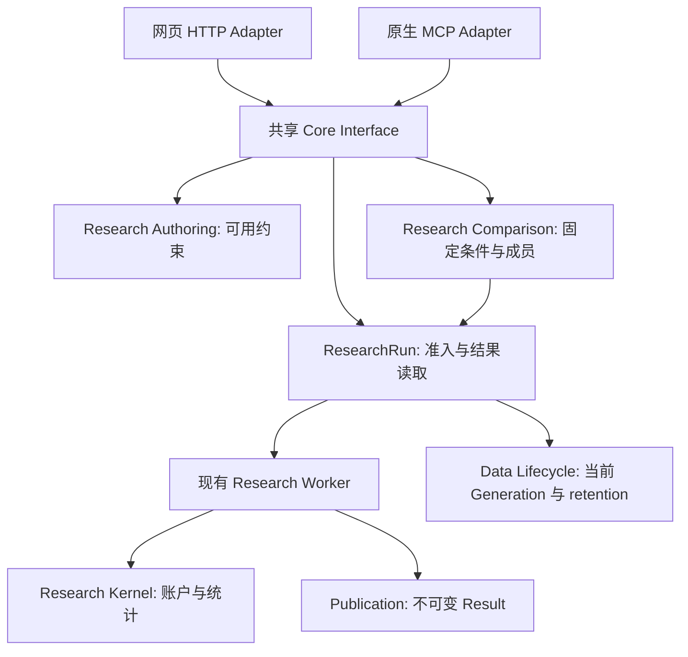

# 历史提案：账户验证与 Research Comparison

> 已归档。本文保留此前方案和修改过程；当前范围以 [首版设计](spec.md) 及 [当前决策树](decision-frontier.md) 为准。本文中的 Comparison、诊断存储和交付顺序均不得作为当前实现要求。

Status: needs-triage

> 最新范围收紧：本轮聚焦回测能力扩展，新增诊断记录、完整交易账本及独立目标/实际仓位历史展示均不再是首版要求。复用现有净值、收益、回撤、费用等结果；只保存正确执行、冻结输入和DailyTrack续算所需的定义与状态。此前关于诊断存储的提案不构成当前交付要求。

> 已接受的新模型使用 selection_every_sessions 控制 Target Selection 更新；日频exposure变化可独立触发下一Open交易。Q1–Q6均已采用推荐，最新确认与剩余范围见 [当前决策树](decision-frontier.md)。本文中原 rebalance_every_sessions / Comparison Module 的提案不是当前实施合同。

> 当前推荐见 [StrategySpec 与 Target Exposure 再审](strategy-exposure-review.md)：结合用户新增讨论，首版建议增加组合仓位表达式；仍不新增持久 Comparison Module。下述原方案仅作为备选记录。

> 2026-09-11 复议：用户补充表达式/策略切换讨论后，本文关于首版新增持久 Comparison Module 的推荐已撤回。当前推荐与待决问题见 [首版范围复议](scope-revision.md)。下文保留为备选设计记录，不作为当前实施指令。

日期：2026-09-11。基于本地 checkout b835997 的代码阅读；这是设计提案，不代表线上已具备、已经实现或已经通过测试。保留工作区中其他任务的修改。

## 结论

推荐新增有明确职责的 `research_comparison` Module，接受一组明确条件、原子创建独立账户的 ResearchRun，并提供有界的进度和结果对照。计算仍归现有 Research Kernel / Research Worker，Result Bundle 仍是唯一结果事实。网页 HTTP 与原生 MCP 是同一 Interface 的两个 Adapter。

本金和单 Run 来源属于现有 ResearchRun Interface；统计属于 Research Kernel；持久诊断属于 Result；比较条件和成员关联属于新 Module。不能把所有工作放进 research_agent，也不能把跨日期请求伪装成现有 Research Batch。

首版按层交付：真实本金 → 可读的分组证据及来源 → 独立账户比较。更细的 TopN 诊断和交易证据必须完成结果保留与迁移设计后再发布。

## 1. 已核对的现状

| 事实 | 当前源码 | 修改含义 |
|---|---|---|
| 提交策略只有持仓数与换仓间隔，没有本金 | `apps/core/src/thesistrace/research_run/models.py:184` | 修改共享输入模型和 authoring constraints，HTTP/MCP 同时获得能力 |
| 接受时固定写 1000 万和固定费用 | `research_run/service.py:277`、`:3951` | 用户输入必须进入冻结条件，不能只留在 Browser Draft |
| Kernel 拒绝其他本金；历史及增量统计引用全局本金 | `research_kernel/strategy.py:320`、`:1074`、`:1378` | 初始化、汇总、费用占比、继续计算均须参数化 |
| Kernel 的 StrategyRunInput 已有本金和费用 | `research_kernel/kernel_run.py:43` | 深化现有值类型，不再增加一个转发式 Account Module |
| DailyTrack 起点已有来源本金 | `daily_track/checkpoint.py:297` | 贯穿核验增量分母与固定起点，不能只测历史回测 |
| q1…q5 与 top-bottom 已保留 | `research_run/result_schema.py:32` | 先展示已有事实，不需新增计算工具 |
| 每组样本数、任意 TopN、逐股历史交易不在现有结果中 | `research_run/result.py:489`、`:517` | 新 evidence 必须在执行时计算并发布，读取不能补造 |
| Research Batch 共享研究区间 | `CONTEXT.md:158`、`research_batch/models.py:55` | 跨起点比较需要不同组织语义 |
| Strategy Comparison 已指策略对 CSI300 | `CONTEXT.md:505` | 新概念采用 Research Comparison |
| 历史 Generation 不是可选、永久可重跑的数据版本 | ADR-0154 | 来源记录身份，不承诺旧数据仍存在 |
| 已有同 Snapshot 准备与事务内创建子 Run 的 Seam | `research_run/service.py:911`、`:950` | 复用并补齐授权/锁/配额规则，不在新 Module 跨表写 Run |

表中未写根目录的 Python 路径均相对 `apps/core/src/thesistrace/`。这些是本地代码事实，不是本次线上部署审计。

## 2. 三种 Interface 方案

### A：最少入口，放进 ResearchRun

在 ResearchRun 内增加验证记录，接受、读取、取消共三个入口；内部创建普通 Run。调用方简单，但 Run 同时承担账户执行、来源与多 Run 比较，相关规则容易继续挤入现有大型 Implementation。即使入口少，也引入了新的持久领域对象。

完整独立草案见 [方案 A](alternatives/minimal.md)。

### B：独立 Research Comparison Module

比较作为有自身固定条件和成员身份的研究对象。Interface 为 inspect / admit / get / list。它协调准入和读取，独立账户由原有 Run 执行。可表达有限、明确的日期、本金、持仓和费用条件；无需通用实验语言。

完整独立草案见 [方案 B](alternatives/flexible.md)。

### C：从 Result 出发的默认验证任务

输入 source Run、账户与一个变化维度，prepare 展开后 submit，再分别读状态与结果。常见调用最简单，但强制 prepare→submit 增加调用顺序、失效处理和上下文 token；单次账户重跑也被迫创建一层验证对象。

完整独立草案见 [方案 C](alternatives/default.md)。

### 比较与推荐

| 方案 | Depth / Leverage | Locality | Seam 的位置与代价 |
|---|---|---|---|
| A | 三个入口隐藏原子准入和成员管理 | 改动集中于 Run，但职责继续增长 | 单 Run 与跨 Run 的知识混在一起 |
| B | 一个固定比较协议覆盖准入、恢复、差异与读取 | 比较规则集中；Run/Kernel 保持原职责 | 多一个有持久职责的 Module，事务组合需要验证 |
| C | 默认任务容易表达 | 默认流程集中 | 调用方必须学习预检失效与二次提交协议 |

选择 B，吸收 C 的“从结果开始”和单维度前端交互。保留直接提交：inspect 可选，admit 始终完整验证。单账户重跑复用 submit_research_run，不额外创建 Comparison。

Deletion test：删除 Comparison Module 后，同代准入、来源复制、成员关联、请求重放、删除事实及比较规则会散回网页和 Agent，说明它具有 Depth。删除一个 explain_factor 转发工具则几乎没有知识需要搬迁，因此不新增这种工具。

## 3. 共享 Interface 与 Agent 能看到什么

### 扩展已有能力

- `get_research_context`：返回真实支持的本金范围、金额精度、费用场景、比较数量上限与数据就绪事实。数据范围与字段可用性不能被说成已测得的每股覆盖率。
- `submit_research_run`：策略输入增加本金；支持闭合的 authored / from_result 来源类型。from_result 从授权成功 Run 复制定义，不能同时传入冲突公式；Factor 来源要求明确 H/R。日期或账户覆盖值必须显式记录。
- `submit_research_batch`：同周期 Strategy Sweep 的 item 可带各自本金和已实现费用参数，继续共享 Alpha/Factor。各自独立账户、独立 Result。
- `get_research_run_result`：沿用 factor、strategy_summary、strategy_observations、provenance 等 section；新增证据只在持久契约落实后开放。
- `get_research_run` / provenance：公开实际生效本金、费用、来源身份与研究条件，不能只返回请求原文。

### 新增比较能力

| MCP 工具（拟议） | 共享 Module 方法 | 含义 |
|---|---|---|
| inspect_research_comparison | inspect | 只读检查，返回展开案例与问题；不创建 Run 或保留 Generation |
| submit_research_comparison | admit | 原子接受 2–20 个显式案例；返回 comparison_id 与所有 run_id |
| get_research_comparison | get | 返回条件、成员状态、有界指标和结果可用性；不触发计算 |
| list_research_comparisons | list | 分页找回已接受比较；支持 Agent 重连与网页历史入口 |

`get` 首版最多 20 行，只返回紧凑指标。曲线和逐日证据继续按 run_id 使用已有结果分页，不把 20 份完整结果塞入一个响应。HTTP 对应相同操作与 DTO；具体路由命名沿用仓库规范。

推荐输入示意（设计字段，尚不可调用）：

```json
{
  "request_id": "capital-100k-start-date-test-01",
  "folder_id": "folder_owned",
  "source": {"kind": "strategy_result", "run_id": "run_owned_source"},
  "data_basis": "current_dataset_head",
  "vary": ["start_date"],
  "fixed": {"initial_cash_cny": "100000.00"},
  "cases": [
    {"case_key": "early", "overrides": {"start_date": "2025-09-01"}},
    {"case_key": "later", "overrides": {"start_date": "2026-01-05"}}
  ]
}
```

`overrides` 必须是有限字段模型，禁止任意 JSON patch。首版变化字段为起止日期、本金、H/R；费用只在费用计算链路交付后加入。Formula、Universe、中性化继承来源且固定。Factor 来源可用，但必须在 fixed 给出 H/R。

每个 case 都是独立全现金起点。结束日期等未覆盖值继承来源；响应必须返回完全展开的冻结条件。上述日期仅演示协议，不代表数据范围已满足。案例不自动增加基线、不自动求笛卡尔积；相同案例明确报重复。未声明变化拒绝；多维变化允许，但不输出单因素解释。

Agent 得到：接受/拒绝、重放标识、真实 Run 身份、数据日期与 Generation、来源条件差异、每行净收益/最大回撤/Sharpe/费用/现金比例、实际区间和样本长度、失败与不可用原因。20% 回撤阈值可用于标记已计算结果，不作为能保证未来回撤的执行承诺。

## 4. Module 职责和隐藏的 Implementation



- 新 `research_comparison/{models,service,schema.sql}`：有界提案、来源快照、案例关联、请求收据、比较投影。私有 Implementation 分文件，不能建通用 DAG/Job 平台。
- `research_run`：账户准入、来源读取、实际执行输入、事务内子 Run 创建、授权后的有界结果投影与删除通知。新 Module 不直接写 Run 的私有表。
- `research_kernel`：本金及费用驱动的确定性账户；因子与 TopN 统计；历史和增量计算一致性。
- `research_agent/registry.py` 与 HTTP：身份、闭合模型、权限、传输和有界分页。不复制来源展开、比较或计算规则。
- `entrypoints/runtime.py`：注入现有 Modules 和真实依赖，不由 Comparison 自建 PostgreSQL/RustFS 客户端。

进程内依赖直接调用现有 Interface；PostgreSQL、Dataset lifecycle、Publication/RustFS 沿用已有 Adapter 与隔离验证入口。本次不新增外部数据供应商或模型依赖。HTTP/MCP 是已经存在的真实变化点，不为了测试制造一套假想可插拔执行器。

## 5. 账户参数必须真正参与计算

复用 StrategyRunInput 的 initial_cash_cny，金额使用规范十进制字符串和 Decimal。共享 constraints 明确正数、精度与有限上界；非法值拒绝，不静默截断或钳制。具体数值范围在实现准入时结合当前资源上限确定，不能给无限金额或以 NaN/Infinity 绕过校验。

完整链路：

Browser/MCP 输入 → Authoring 验证 → ImmutableRunInput → Kernel 初始化及执行 → Result/provenance → DailyTrack origin/advance。

移除 Kernel 对固定金额的等值要求及所有全局分母引用。更新普通执行、Batch sweep、Chunk continuation、终态累加和 DailyTrack 的同一账户合同；不采用 monkeypatch 全局常量。

首个切片只开放本金，沿用当前明确费用，不阻塞于设计经纪商权限系统。后续费用压力采用一个明示的额外成交成本参数，买卖分别按实际成交金额增加成本，参与可买现金判断、最小手数取整、逐日成本和净资产；不在结束收益上简单扣点。税费与最低佣金各保留原含义，完整生效费率写入冻结输入。

Gross/Net 沿用同一成交路径下的成本含义；无成本重新跑出的成交路径属于另一独立 case。继续沿用现有 synthetic total-return accounting，不把本次本金参数化描述为完整券商仿真。

## 6. 因子诊断：先利用已有事实，再增加可审计证据

第一层立即可设计实现：展示现有 1/5/20 日 q1…q5、Top-Bottom、IC/Rank IC 和当前覆盖信息。明确单位是 Forward Return Label 均值，不是净收益或可执行组合曲线。Top-Bottom 按共同有效日计算，不能拿独立有效日的 q5 均值减 q1 均值替代。

第二层新增紧凑持久统计：
- 每组有效日数、样本总数及每日日均样本数，分母显式返回。
- Top-Bottom 共同有效日数与共同有效日上的差值均值。
- TopN 的 requested_n、selected_count、valid_label_count、有效日数、标签均值与缺失原因计数。
- Strategy Run 的 TopN 使用该 Run 的 H；独立 Factor 首版固定诊断 N=10/20/100，避免读取时临时重新运算。

TopN 先从 Final Alpha Cross-Section 按明确排序选定，再连接未来 Label；缺失 Label 不用低排名股票补位。排序方向和并列规则固定并进入计算契约。每个 horizon 独立统计标签可用性，不让未来数据改变候选集合。遵守 ADR-0077。

上述统计解释“选出的信号有什么表现”；账户现金、换手、费用和市场拒单解释执行事实。它们不足以自动给出“收益差距全部由某原因导致”的因果结论。

逐股历史账本不是首版隐含必需项。若要回答某天为什么少买、哪只因资金不足未成交，必须新增执行时保留的 decision/trade 证据，至少含日期、标的、候选/目标/实际数量、现金约束和确定原因码。应单独决定采样范围、字节预算、分区和 ADR-0099 的窄化修改；不能承诺现有 Result 能恢复这些内容。

## 7. 原子性、恢复、权限与保留

1. 所有 case 同一次准入使用一个当前 Dataset Admission Snapshot。准备阶段解析和估算；短事务内重检来源/Folder 权限、幂等、总配额、当前 Head 与 retention。任一失败整体回滚。
2. inspect 返回 observed Head 和可选提交前置条件；不创建租约。admit 可直接调用；有 expected Head 且变化时拒绝，无 expected Head 时使用准入阶段的当前 Head。准备与提交间 Head 变化也须整体拒绝/重新准备后再接受，不能组内混代。
3. researcher + request_id 与规范请求绑定；同请求重放返回原对象及成员，异请求冲突。重放先于来源重新解析，因此来源后续删除不应造成重复创建。
4. 短事务需沿用并核对现有锁顺序；配额按全部 case 预检并在事务内串行化。现有 prepare_child_admission / admit_prepared_child_in_transaction 是复用起点，不代表并发配额、来源删除竞态已经得到证明。
5. 首版每个 case 由普通 Worker 执行，执行 owner 固定 ordinary；无新 Comparison Worker，无额外恢复状态机。对比状态从成员及 tombstone 投影，accepted 与 completed 分开。
6. 源复制需同时具备读取与执行权限，并核验 Researcher ownership；不得用请求中的 owner_id。registry 当前单 required_scope 需扩展为全需权限语义并验证工具发现及调用。取消权限独立，首版复用单 Run 取消，不假装批量取消原子成功。
7. 保存来源 run_id、输入/Result 身份、复制定义与原始条件；新执行使用当前数据。来源删除不级联删新 Run，不永久 retain 原 Generation。
8. 成员删除保留 case_key、原 run_id、输入身份和删除事实，指标标为不可用；不从缓存恢复已删除 Result、不自动重跑。Comparison 本身不成为永久保存原始数据或全部 Result 的隐藏引用。
9. 一行 failed/cancelled/deleted 不等于收益 0。返回结构化原因、字段/case_key 和 retryable 分类；永久资源失败不以缩短历史等方式静默重试。

首版 Comparison 普通执行会重复准备/Alpha 计算，必须如实描述。现有同区间 Batch 继续提供共享计算。后续只有在实测收益足够时，才把相同 Generation/Period/Alpha/Universe/中性化/诊断契约的 case 内部分组进 Batch；不同日期不能声称共享同一 Alpha/Factor 成品。优化前后要求完整 Alpha/Strategy 恢复语义和相同结果，不能增加第三套 Worker。

## 8. Result 与 schema 演进

本金值在既有冻结输入和 Result 中已经存在：原有 1000 万记录保留原值与身份；不要为了增加提交字段改写历史结果。

新增诊断改变的是持久 Result 结构。当前 result.py 有严格 payload 集合和每 504 研究日 1 MiB 的结果预算，不能直接附加全市场逐股 JSON。

执行实现前须完成独立的结果演进方案与验收：
- 单一当前读取/计算合同；不加运行时旧版分支。
- 显式迁移若需要生成新格式，发布新的不可变对象与原 Result 身份映射；旧对象字节不原地修改，原计算合同不改标签。
- 历史未算指标用当前合同的 availability=not_recorded_at_execution 表达，不填 0、不推断 TopN、不在读取时重算。
- 迁移需覆盖所有引用和 DailyTrack origin 绑定，不能只换 Run manifest。必须证明原结果身份、追踪起点及其计算语义可保留；证明不了时，该切片不得发布。
- 迁移前备份，限定 source/target，记录结果；验证失败回滚、重复执行和 GC 引用。复用现有显式迁移机制，但现有 rank_ic 迁移仅回填数据库投影，不能拿它当完整 Result 格式迁移证明。

此处是需要先完成的工程设计门槛，尚未声称有可执行迁移脚本。已有 q1…q5 的展示和本金交付可先独立推进。

## 9. 前端按现有研究路径改

1. ResearchWorkspacePage 的策略参数区增加本金，单位 CNY；支持常用金额快捷选择，但实际值来自共享 constraints。费用仅显示实际已支持参数。
2. ResearchRunsPage 的 FactorHorizonView 展示已有分组值、单位与可用性；增加“验证账户”动作，把已授权来源和用户参数提交到共享 Interface。需要预览时用 inspect，前端不自行复制研究规则。
3. 单账户验证进入新 Run 详情。多条件验证在 Research Runs 内显示比较记录和成员表，不新增顶级导航。
4. 比较表先展示条件差异、区间、数据身份、状态与指标；曲线按需加载。日期不同显示独立起点及样本长度，避免把累计收益排序当作同条件结论。
5. 保留 StrategyComparisonPanel 的 CSI300 含义；新视图命名“研究条件对照”。前端可优先提供单维度编辑，MCP 仍使用相同的显式案例模型。

遵循仓库 DESIGN.md。真正界面验收应在实现后用 in-app browser 完成；本次没有以未实现效果图充当验收。

## 10. 分步交付和验证

| 顺序 | 可独立交付的行为 | 必要验证 |
|---|---|---|
| 1 | 单 Run / 同周期 Batch / DailyTrack 全链路本金 | 独立手算最小手数与最低佣金 Fixture；10 万与1000 万确实产生各自现金/持仓；无取整成本干扰时比例关系成立；相同本金普通/Batch/继续计算一致 |
| 2 | 已有 q 分组展示、来源驱动单账户验证 | 现有 Result 值直出、单位和缺失状态；来源权限/删除竞态；HTTP 与 MCP 冻结输入一致；浏览器完整操作 |
| 3 | 新诊断的结果演进与统计 | 先迁移证明；并列、空组、标签缺失、TopN 不补位、共同有效日、字节预算、分页及不可变身份 |
| 4 | Research Comparison 原子准入与读取 | 真实 PG/RustFS：并发重放、全组拒绝、配额/刷新/删除竞态、断线后找回、Worker 恢复、成员删除事实 |
| 5 | 费用压力与精细执行证据（按需求分别交付） | 成本参与可买现金及净值；新增证据预算/保留；DailyTrack 和普通/Batch 结果一致 |

Kernel 纯计算复用公开 run/advance Interface，使用小而能独立核算的数据。数据库/retention/权限/Worker 用仓库真实隔离入口，不能用 Fake 事务证明。HTTP/MCP 契约测试覆盖成功、拒绝、权限和分页。工程 Agent 流程使用 Scripted/Replay；真实模型效果另测成功率、调用数、成本和延迟。

不因本设计运行全套测试；实现时根据改变行为选择现有定向入口。旧测试仅在行为被等价覆盖且失去独立价值时替换。

## 11. 必须更新或保持的架构决定

- 保持 ADR-0151 / 0220 / 0222：Core 的 Module 权威、共享 MCP Interface、资源地址和幂等。
- 保持 ADR-0154 / 0190：当前数据准入冻结，来源不等于历史可重跑权限。
- 保持 ADR-0216：Batch 同范围共享与完整任务恢复，不偷改为异日期 Batch。
- 保持 ADR-0077 / 0070 / 0104 / 0108：先 Alpha 后 Label、双单位账本、固定追踪起点、精确历史/增量等价。
- 新增 Research Comparison 领域定义与关于固定协议/普通 Run 执行的 ADR，待设计采用后写入正式 CONTEXT/ADR。
- 新诊断格式必须协调 ADR-0099 / 0211。只修改被证明需要的结果保留及显式演进决定，禁止保留多版本运行路径。
- 不把 rolling window 独立重启称为 walk-forward，更不称为会在线切换策略。真正时段自适应需另定义训练/选择窗口、仅使用当时可见数据的选择规则及样本外串接账户。

## 本次产出与限制

已完成当前代码阅读、三种独立 Interface 草案与本推荐设计。没有修改产品 Implementation、执行回测、运行工程测试、部署或提交。金额上界和新 Result 迁移仍是相应切片实施前需落定的细节，不把整份提案标为 ready-for-agent。
