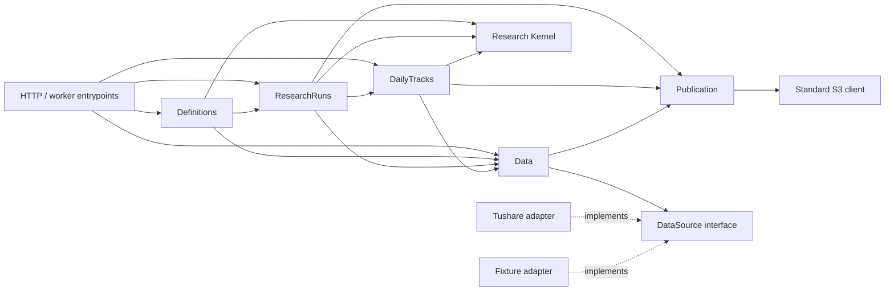

# ThesisTrace Core Architecture

> Status: implemented Core architecture, accepted on 2026-08-05.

## Objective

The current product phase has one goal: close the reproducible research loop
from Data through Research Definition, ResearchRun, Result, and DailyTrack.
Login, tenancy, hosted deployment, collaboration, and production operations are
deferred. They must not add branches or dependencies to the Core while this
loop is being built.

There is one ThesisTrace product and one canonical runtime. Development and a
future hosted deployment use the same Core implementation. Deployment may
change credentials, process counts, and S3 endpoint configuration; it does not
select a `local` or `hosted` product mode.

## Product loop

```text
Data Update
    -> immutable Dataset Release
    -> Save mutable Research Definition
    -> Run current Definition against latest Release
    -> immutable ResearchRun Result
    -> Start DailyTrack
    -> later Dataset Releases advance that Track
```

The four product resources are:

1. Data and its immutable Dataset Releases.
2. Research Definitions.
3. ResearchRuns.
4. DailyTracks.

Definition Snapshot, execution Attempt, Tracking Advance, Tracking Checkpoint,
Working Cache, and publication manifest are internal implementation concepts.
They have no product URL or Web page.

## Design rules

- Organize by deep product module, not by repository-wide technical layers.
- A module owns its rules, lifecycle state, PostgreSQL statements, and product
  projection.
- Dependencies are explicit and one-way. Core never imports Hosted code.
- Add a seam only when at least two real implementations exist or an external
  system must be isolated. Do not create generic repository, job, command-bus,
  or plugin interfaces.
- PostgreSQL is the only Product State implementation. A standard S3 client is
  the only immutable-object implementation.
- HTTP and worker entrypoints are thin adapters. They do not contain product
  rules or lifecycle sequencing.
- Research Kernel is pure. It knows no product IDs, PostgreSQL, S3, HTTP,
  worker, quota, or Hosted concepts.
- Favor locality: changing a lifecycle rule should normally change one module
  and its tests, not Web, routing, global storage, and worker code together.

## Physical layout

```text
src/thesistrace/
├── data/
├── definition/
├── research_run/
├── daily_track/
├── research_kernel/
├── publication/
├── entrypoints/
└── _postgres/

web/src/
├── shell/
├── data/
├── definitions/
├── research-runs/
└── daily-tracks/
```

There are no global `models/`, `repositories/`, or `services/` directories.
The private `_postgres` package contains only connection-pool, migration-runner,
and transaction helpers; it contains no module migrations or domain SQL.

## Module interfaces

The signatures below define semantics rather than a required Python syntax.
Product callers use these interfaces through an in-process call or the thin
HTTP adapter.

### Data

```text
data.overview() -> DataOverview
data.list_releases(...)
data.get_release(release_id)
data.update(request_id) -> UpdateAcceptance
```

`data.update` is a durable asynchronous action. The HTTP call records the
request and returns `accepted`; it does not wait for collection or publication.
The worker later records one terminal outcome: `published`, `no_change`, or
`failed`. It performs the first three-year Bootstrap when no Release exists and
an incremental or catch-up publication afterward. `no_change` means no new
completed Research Session exists and creates no Release. At most one update is
active.

`overview` supplies the Data page's `idle`, `updating`, or `failed` state, the
latest terminal update outcome, and the latest Release. Dataset Release itself
is immutable and is never overwritten.

Other Core modules consume Data only through these private dependency
interfaces; they never query `data.*` or read Data's S3 objects directly:

```text
data.latest_release() -> ReleaseRef
data.next_release(after_release_id) -> ReleaseRef | None
data.load_canonical(release_id, requirements) -> CanonicalDataset
data.authorable_fields() -> AuthorableFieldCatalog
```

Data owns the only provider seam:

```text
DataSource.collect(collection_plan) -> CanonicalSourceBatch
```

Tushare and Fixture are adapters for this interface. They handle provider
protocol and mapping into stable canonical records. Data remains responsible
for coverage, schema, point-in-time, calendar, and publication validation.
Neither adapter knows Dataset Release IDs, PostgreSQL, S3, ResearchRun, or
DailyTrack. The product interface never exposes `live`, `fixture`, `bootstrap`,
or `increment` variants.

### Research Definitions

```text
definitions.list(...)
definitions.get(definition_id)
definitions.authoring_options()
definitions.save(definition_id_or_none, current_content, expected_revision)
definitions.run(
    definition_id_or_none,
    current_content,
    expected_revision,
    request_id,
)
```

There is no Draft resource or lifecycle state. Save covers creation and update.
It accepts incomplete or currently non-runnable authoring content. A malformed
document with unknown properties or wrong structural types is rejected without
a write.

Editable content is limited to:

```text
name?                       # generated on first Save when absent
hypothesis?                 # optional
alpha?                      # one expression tree
universe?                   # top300 | top1000 | top2000 | top3000
neutralization?             # none | industry
holdings_count?             # 1..100
rebalance_every_sessions?   # 1..20
```

The expression tree references stable `field_id` and `operator_id` values.
Data owns field definitions and Release availability. Research Kernel owns
operator arity, types, and semantics. `authoring_options` combines these for
the Web, which does not hardcode a second catalog.

Strategy kind, initial cash, execution, costs, risk-free rate, numeric
contract, semantic versions, field bindings, and Dataset Release are not
editable content. The Definition implementation injects them during Run.

Every successful Save or Run-side Save advances `revision`. Updating an
existing Definition requires `expected_revision`; creating one requires
`expected_revision = None`. A mismatch changes nothing. The generated name is
stable and may later be edited. Hypothesis is never a Run requirement.

Run is one atomic action:

1. Validate request structure; a malformed request writes neither content nor
   a receipt.
2. Look up `request_id` and compare the stored request fingerprint before any
   new write.
3. Lock the target Definition and check `expected_revision`.
4. Save the submitted current content and advance its revision.
5. Resolve the latest successful Dataset Release, validate runnable semantics,
   and inject fixed contracts and field bindings.
6. On rejection, record the saved revision and issues in the receipt but create
   no immutable input and no ResearchRun. On acceptance, call private
   `research_runs.admit(tx, immutable_input)` and record the resulting queued
   ResearchRun in the receipt.
7. Commit the Definition, receipt, and any admitted ResearchRun once.

`request_id` covers both accepted and rejected outcomes. Retrying the same ID
with the same content returns the original saved revision, issues, or
ResearchRun ID without another write. Reusing it with different content is a
conflict.

The immutable input is private data owned by ResearchRun. There is no Snapshot
table that callers can list and no Snapshot identifier in a product response.

### ResearchRuns

```text
research_runs.list(...)
research_runs.get(run_id)
research_runs.cancel(run_id, request_id)
research_runs.rerun(run_id, request_id)
research_runs.start_tracking(run_id, request_id)
```

ResearchRun creation is allowed only through `definitions.run` or `rerun`.
There is no generic create, update, or delete operation.

The product states are:

```text
queued -> running -> succeeded | failed
queued -> cancelled
running -> cancelled
```

Attempt, claim, lease, heartbeat, and retry state stay inside the module.
Automatic retry remains visible as `running`. A final timeout is `failed` with
a readable reason.

Cancel is complete when PostgreSQL atomically records `cancelled`. A worker may
need time to stop computing, but fencing prevents any late success or Result
publication. If success or failure won the race first, Cancel returns that
existing terminal state and never overwrites it.

Rerun always creates a new ResearchRun ID using exactly the selected Run's
immutable input and Dataset Release. It ignores current Definition edits and a
newer Release.

`start_tracking` is an action on a succeeded ResearchRun because that module
has the facts required to validate the Result. It atomically passes a complete
immutable Activation Input to private `daily_tracks.activate`; DailyTracks uses
its own state to enforce one Track per seed Run and the active-Track limit.
The product action guarantees both constraints without ResearchRuns querying
`daily_tracks.*`. DailyTrack does not read back through ResearchRun afterward.

A succeeded `get` includes its Result product projection: Factor summaries for
the 1-, 5-, and 20-session horizons, Strategy summaries and retained daily
observations, the Strategy's selected-Universe Benchmark, and provenance. It
does not include object keys, manifests, continuation state, or raw execution
data. The Result is part of ResearchRun detail, not a fifth product resource.
The Result Bundle remains at most 1,048,576 exact bytes.

### DailyTracks

```text
daily_tracks.list(...)
daily_tracks.get(track_id)
daily_tracks.retry(track_id, request_id)
daily_tracks.stop(track_id, request_id)
```

DailyTrack has no generic create operation. Its product states are:

```text
active | blocked | stopped
```

An active Track independently discovers successor Dataset Releases. Data never
calls or waits for DailyTrack, and publication continues when a Track is
blocked. A Track processes its own Release progression in order and moves its
Tracking Head only after a complete Checkpoint publication.

After automatic retries are exhausted, the Track becomes `blocked`, keeps its
last successful Head, and exposes a readable reason. `retry` continues the same
failed target; success returns it to `active`. Other Tracks and Data publication
are unaffected. `stop` is allowed from active or blocked and is irreversible.

The current product runtime permits at most ten active or blocked Tracks.
Stopped Tracks do not count.

DailyTrack stores a complete Tracking Origin at activation: seed Run identity,
immutable input, seed Release, Result reference and checksum, initial Strategy
state, and calculation contracts. Its later dependencies are only Data,
Research Kernel, and Publication.

DailyTrack detail shows current status, origin, Head Release, lag or blocked
reason, recent Factor summaries, and the Strategy/Benchmark view. Factor and
chart observations use different bounded windows: Factor Summary uses the
latest 504 valid signal sessions, while the Strategy/Benchmark chart uses the
latest 504 Research Sessions. Cumulative Strategy metrics remain measured from
the fixed Tracking Origin. Internal Checkpoints and object chains are not
returned.

### Research Kernel

```text
research_kernel.run(run_input) -> run_output
research_kernel.advance(track_input) -> track_output
research_kernel.operator_catalog() -> OperatorCatalog
```

The two explicit entry points share one implementation of Alpha calculation,
Label maturation, Factor aggregation, Strategy transitions, numeric rules, and
canonical ordering. There is no `mode` parameter and no separately maintained
batch and incremental engine.

`run` starts from the canonical initial state and consumes the fixed Research
Window. `advance` starts from a prior immutable state and consumes new Research
Sessions. Processing the same sessions once or in chunks must produce the same
state at the same boundary.

Operators are a closed, versioned catalog inside the Kernel. Adding one means
adding code, tests, and a semantic-version change. There is no runtime plugin
registry, Python evaluation, SQL expression, or user-defined function.

### Publication

Publication is a shared deep module used by Data, ResearchRuns, and
DailyTracks. Callers provide immutable payloads and provenance. The module
hides serialization, checksums, content-addressed S3 keys, manifest creation,
verification, recovery, and orphan discovery.

Its private interface is:

```text
publication.prepare(kind, payloads, provenance) -> PreparedPublication
publication.record(tx, prepared) -> PublishedRef
publication.read(published_ref) -> VerifiedBundle
```

`prepare` serializes, hashes, and uploads immutable bytes. `record` writes only
Publication-owned manifest and object records into the caller's concrete
PostgreSQL transaction and does not commit it. The calling product module
checks its own fence, moves only its own lifecycle or sequence reference, and
commits both changes once. Publication never updates `data.*`,
`research_runs.*`, or `daily_tracks.*`; those modules never write
`publication.*`.

Publication is not a generic object browser. Callers and the Web never receive
physical S3 paths.

## Dependency direction

An arrow means the left module may depend on the right module:



In particular:

- Data, Research Kernel, and Publication never import their callers.
- DailyTrack never imports ResearchRun or Definition.
- Definitions and ResearchRuns may create a downstream lifecycle resource only
  through its private admission interface.
- Entry points depend inward. Product modules never import entrypoints, Web,
  or Hosted.
- Import-direction tests enforce these rules.

The dependency arrows are exercised through explicit private calls:

```text
Definitions -> Data.authorable_fields / Data.latest_release
Definitions -> ResearchKernel.operator_catalog
Definitions -> ResearchRuns.admit
ResearchRuns worker -> Data.load_canonical
ResearchRuns -> DailyTracks.activate
DailyTracks -> Data.next_release / Data.load_canonical
Data / ResearchRuns / DailyTracks -> Publication.prepare / record / read
```

These are module interfaces, not HTTP endpoints or runtime-selectable plugins.
DailyTracks asks Data for the direct successor of its current Head; it never
queries Data tables or jumps straight to the latest Release.

## Extensibility and scaling

The modules are intentionally dependent in the direction of the product flow;
modularity does not mean making every resource unaware of every downstream
action. The seam is the narrow module interface, while lifecycle rules and SQL
remain behind it. Internal handler, processor, and SQL files may exist for
local clarity, but they do not become repository-wide horizontal layers.

This shape has explicit growth paths without carrying two implementations now:

- HTTP processes and module-owned workers may run in multiple identical copies;
  PostgreSQL claims, constraints, and fencing coordinate them.
- If a module later needs an independent service boundary, its existing private
  interface is the extraction seam. Other modules do not move their SQL or
  learn its storage layout.
- A different S3-compatible deployment changes endpoint and credentials only.
  A genuinely new external market-data source adds one DataSource adapter.
- A new Alpha operator is a versioned Research Kernel change with tests, not a
  runtime plugin or a Web-only option.
- Future identity wraps the same Core actions with ownership context; it does
  not fork the domain into Local and Hosted implementations.

## PostgreSQL ownership and atomic admission

One PostgreSQL database contains five schemas:

```text
data.*
definitions.*
research_runs.*
daily_tracks.*
publication.*
```

The minimum ownership map is:

```text
data:
  state, releases, update_receipts, update_attempts, fields, release_fields
definitions:
  definitions, run_receipts
research_runs:
  runs, attempts, action_receipts
daily_tracks:
  tracks, advance_work, attempts, action_receipts
publication:
  objects, manifests, manifest_objects
```

Each module owns its schema, migrations, queries, idempotency receipts,
lifecycle records, and sanitized failure data. One module never queries or
updates another module's tables directly. Direction-consistent foreign keys
are allowed, but cross-schema joins do not implement product rules.

PostgreSQL enforces one active Data Update, unique
`(track_id, target_release_id)` advance work, unique `seed_run_id` for
DailyTracks, and unique `(action, request_id)` receipts with a stored request
fingerprint. Every module's migrations and SQL remain in that module;
`_postgres` owns only the machinery that executes them.

There is no database port because PostgreSQL has one implementation. The small
private `_postgres` helper exposes a concrete `PostgresTransaction` so a
cross-module admission can be truly atomic without sharing SQL:

```text
definitions.run
└── PostgreSQL transaction
    ├── Definitions saves its own row
    └── ResearchRuns.admit(tx, immutable_input)

research_runs.start_tracking
└── PostgreSQL transaction
    ├── ResearchRuns validates its Run and records its action receipt
    └── DailyTracks.activate(tx, activation_input)
```

The downstream module retains its SQL and does not commit. The action-owning
module commits all changes once. `PostgresTransaction` never appears in the
product interface, Web, or Kernel.

## Action idempotency

Every action interface that accepts `request_id` follows one rule inside its
owning module:

- Look up the receipt before a new write.
- The same action, target, and input fingerprint returns the original outcome.
- Reusing the ID with different action input returns a conflict.
- `start_tracking` replay returns the originally activated DailyTrack.
- Structurally malformed requests create no receipt.

Receipts live in the action owner's schema: Data Update in Data, Definition Run
in Definitions, ResearchRun actions in ResearchRuns, and DailyTrack actions in
DailyTracks. There is no global idempotency table or command envelope.

## Immutable publication with S3

PostgreSQL is authoritative for lifecycle state, manifests, checksums, and
visible publication references. S3 stores immutable JSON and Parquet bytes.

The publication order is fixed:

1. Canonically serialize each required payload and calculate its checksum.
2. Upload bytes to a content-addressed S3 key that is never overwritten.
3. In one PostgreSQL transaction, Publication records the complete manifest,
   then the owning module validates its fence and moves its own publication
   reference.
4. Treat the publication as visible only after PostgreSQL commits.

An S3 upload followed by a PostgreSQL failure creates an invisible orphan that
can be cleaned later. It never changes the previous Release, Result, or
Tracking Head. Readers start from the PostgreSQL reference, then load and
verify every referenced S3 object. ThesisTrace does not attempt a PostgreSQL/S3
distributed transaction.

The application uses an existing S3-compatible implementation through a
standard client. It does not implement an object-store server, custom storage
tokens, or HTTP proxy. Development and continuous integration use one pinned
RustFS container. A future deployment changes the endpoint and credentials,
not application code.

## Worker implementation

Durable PostgreSQL state is acceptance. There is no Temporal, outbox relay,
global job table, event bus, or `dispatch(kind, id)` interface.

The worker entrypoint calls module-owned processors. Each module claims its own
queued work transactionally, records private Attempts, applies bounded retry,
and fences stale workers. Multiple copies of the same worker implementation
may run because PostgreSQL claims and fencing decide ownership.

DailyTrack's Working Cache is a private, disposable implementation detail on
the worker's local disk. PostgreSQL state and immutable S3 Checkpoints are the
truth. A missing or corrupt cache is discarded and rebuilt from immutable
state. Stop never depends on the HTTP process seeing that disk: every worker
reconciles its own cache against terminally stopped Tracks, and a worker
rechecks durable Track status and fence after installing a cache replacement.
This makes cleanup idempotent across API/worker restarts and prevents late
workers from restoring cache state after Stop. No `WorkingCachePort` exists.

## HTTP and Web adapters

The HTTP adapter maps stable URLs and typed requests onto module interfaces. It
does not perform Save-then-Run sequencing, resolve latest Release, dispatch
workers, expose SQL fields, or branch on deployment type.

Stable Web routes are:

```text
/data
/definitions
/definitions/:definitionId
/research-runs
/research-runs/:runId
/daily-tracks
/daily-tracks/:trackId
```

The Web Shell owns navigation and the current route only. Each of the four Web
modules owns its list, detail, actions, loading, refresh, error handling, and
browser acceptance. There is no Workspace Dashboard, Operations Ledger, raw
JSON popup, object download, Hosted label, or authentication wrapper in the
current product.

Future login supplies an identity to the same product interface. It does not
change resource shapes, actions, or URLs.

## Verification

The default Core gate has three seams:

1. Pure Kernel tests cover numeric rules, operator behavior, and once-versus-
   chunked equivalence.
2. Product integration tests use real PostgreSQL and real pinned RustFS. They
   cover transactions, revision conflicts, idempotency, claims, retries,
   fencing, publication failure, and restart recovery.
3. Desktop browser acceptance drives the real Core runtime with Fixture data
   through Data Update, Save, Run, Result, Rerun, DailyTrack start, later Data
   Update, automatic advance, blocked Retry, and Stop.

The complete gate also proves that an invalid Run saves the Definition without
creating a ResearchRun; Rerun keeps the original input and Release; Cancel
rejects late results; and a succeeded Result Bundle stays within one MiB.

`make check` must contain only Core tests and the Core browser flow. Live
Tushare verification is an explicit separate gate. Hosted, login, tenancy,
deployment, and archived Hosted V2 tests are absent from the default gate.

## Deferred and removed scope

Deferred until after the Core loop is accepted:

- Login, InsForge, Auth Session, User, Personal Workspace, RLS, and RBAC.
- Hosted deployment, Cloudflare, Caddy, backups, alerting, capacity
  qualification, and production rollout.
- Collaboration, organizations, invitations, downloads, notifications, and
  billing.

Removed from the active architecture:

- Draft and separately browsable frozen Definition versions.
- Local/Hosted product modes and two runtime implementations.
- SQLite Product State.
- Temporal, execution outbox, relay, event bus, and generic scheduler.
- Self-built object-store server and remote filesystem proxy.
- Global metadata port, repository-per-table interfaces, and generic command
  envelope.
- Cross-ResearchRun comparison, delete operations, raw artifacts, and internal
  lifecycle pages.

Hosted V2 must be preserved through an explicit Git archive ref before its
active code is removed. A later hosted phase starts from this accepted Core and
selectively adds deployment and identity adapters; it does not restore the old
dependency graph wholesale.

## Completed migration

The Core closure preserved validated quantitative behavior while replacing the
old lifecycle and persistence implementation:

1. Lock Alpha, Factor, Strategy, and numeric behavior with characterization
   tests and extract the pure Research Kernel.
2. Establish PostgreSQL, RustFS, module schemas, Publication, and import rules.
3. Close the Data vertical slice while establishing the Web Shell and Data Web
   module.
4. Close Save in the Definitions module and its Web module.
5. Close Run, Result, lifecycle actions, and Rerun in ResearchRuns and its Web
   module.
6. Close DailyTrack activation, advance, blocked Retry, and Stop in DailyTracks
   and its Web module.
7. Complete the Web cutover by removing the old surface after every replacement
   route is already accepted.
8. After browser acceptance, remove the old lifecycle paths and Hosted runtime.
9. Make the complete Core flow the default gate.

There is no long-lived compatibility adapter and no period in which two Core
runtimes are considered supported products.
