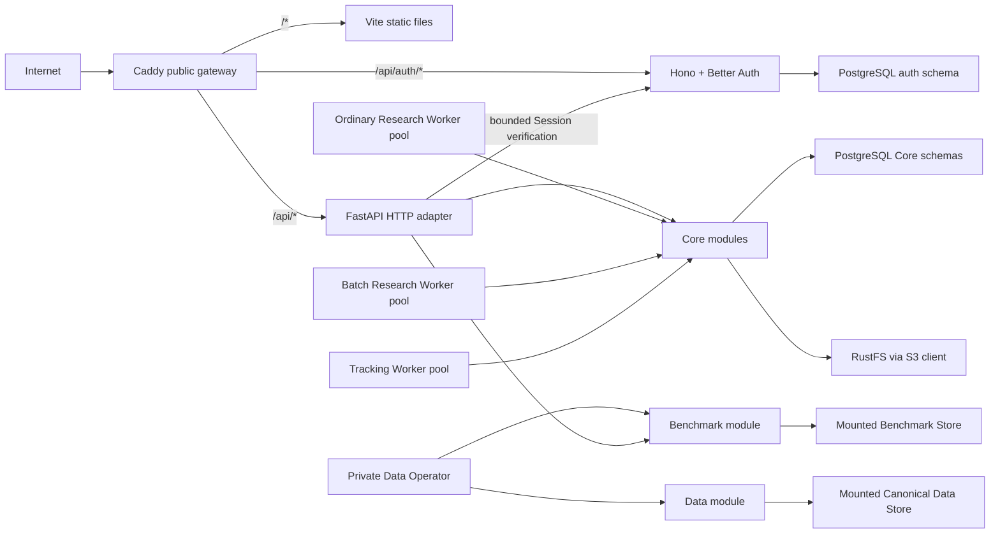
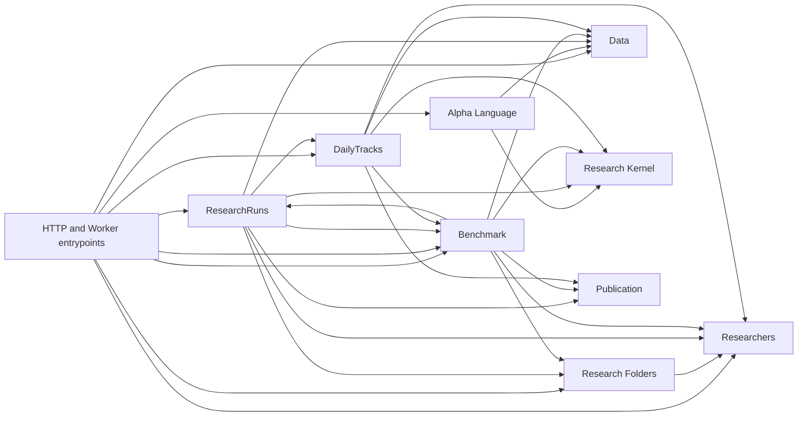

# ThesisTrace Core Architecture

> Status: current module-first product, execution, identity, ownership, and
> public-entry boundary from ADR-0194 through ADR-0211 and ADR-0233.

## Product boundary

The active checkout closes one invite-only, multi-Researcher research loop:

```text
Data Operator prepares the current Dataset Head and CSI 300 Benchmark Snapshot
    -> Data Overview exposes Dataset and Benchmark readiness read-only
    -> author one browser-local Draft inside a Research Folder
    -> Run compiles and atomically admits one immutable ResearchRun
    -> a ResearchRun Attempt pins the Generation frozen at admission
    -> immutable Factor and Strategy Result
    -> optionally start a DailyTrack
    -> later market sessions advance that Track
```

The browser-visible resources are Data Overview, Research Folders, Research
(ResearchRuns), and DailyTracks. Research Batches are a backend API resource in
V1 and their child ResearchRuns appear in the Batch Research Folder; there is no
Batch browser surface. Browser Draft is local authoring state rather than a
server resource. Benchmark Store, Data Generation, execution Attempt, Tracking
Checkpoint,
Working Cache, publication manifest, and schema fingerprint are implementation
concepts, not additional product resources.

ADR-0233 places that research loop behind invite-only Researcher authentication
and direct per-Researcher Research Ownership. It adds no Workspace,
Organization, role hierarchy, collaboration model, or Local/Hosted product
mode.

## Runtime topology

The active Compose topology contains Caddy Web, Auth, API, three fixed-role
Worker pools, PostgreSQL, RustFS, and two one-shot schema initializers. The
ordinary Research, Batch Research, and Tracking roles start from the same
Production Image and executable. Persistent Development, disposable Test, and
single-node Production use the same product implementation with distinct
Compose identities, ports, volumes, data mounts, and environment contracts.

The Web image uses Caddy, and a separate Hono and Better Auth service owns
authentication alongside its schema initializer. Caddy is the only browser
origin. Production publishes only Caddy on ports 80 and 443; Auth, Core,
PostgreSQL, RustFS, and Workers remain on the private Compose network.
Development and Test use the same route graph over loopback HTTP and retain
explicit loopback-only diagnostic ports where the local lifecycle needs them.



Caddy evaluates mutually exclusive `handle /api/auth/*`, `handle /api/*`, and
static fallback groups in that order and never strips either API prefix. API and
Auth responses are not cached, the SPA entry and fallback are not cached, and
hashed static assets are immutable and long-lived. Production Caddy owns
automatic HTTPS and persists its certificate state; one exact non-secret
`THESISTRACE_PUBLIC_ORIGIN` drives the Caddy site, Better Auth base URL, email
links, and Core Origin checks rather than inferring authority from request
headers.

PostgreSQL Core schemas store Research Ownership, product lifecycle state,
action receipts, attempts, data operation state, pins, and publication
manifests. The independent `auth` schema stores identity, credentials, Login
Sessions, invitations, verification records, rate limits, and security audit
records. RustFS stores immutable ResearchRun and DailyTrack publication bytes.
The mounted Canonical Data Store contains the current Dataset Head and
immutable-while-referenced Data Generation files. No runtime downloads data
during API or Worker startup.

## Identity and access

### Authority boundary

Hono and Better Auth are the sole authority for canonical email, initial
display label, active state, credentials, Login Sessions, and authentication
cookies. Better Auth generates UUID User IDs; Core reuses that UUID directly as
the Researcher ID and stores no identity mapping or duplicate email and active
state. Core is the sole authority for Research Ownership and all product
authorization. Auth has no Core-schema privileges, Core has no `auth`-schema
privileges, and Caddy headers never assert an identity.

Every Core `/api/*` request, including Researcher bootstrap, carries the
browser's original Cookie through one bounded private Auth verification call.
That call forces a database-backed Better Auth lookup without refreshing the
browser Cookie. Core accepts only the verified Researcher ID and active state;
it never decodes a JWT, reads Better Auth tables, accepts an API key, or caches
an identity. An invalid, expired, revoked, or deactivated Session is `401`.
Auth timeout, unavailability, or a malformed verification response is `503`
with no anonymous fallback.

Hono remains the only cookie writer. The Web Auth provider calls the public
same-origin `/api/auth/get-session` on initial load, window focus, network
recovery, and every 12 hours while active so Better Auth can refresh both its
database Session and browser Cookie. FastAPI's private verification disables
refresh and never forwards `Set-Cookie`.

### Invitation and provisioning

Researcher creation is invite-only. The Operator issues at most one effective
48-hour Researcher Invitation for one lowercase trimmed email through a private
Auth command. Invitation delivery uses the existing Resend API directly and is
usable only after Resend accepts the message; reissue revokes the preceding
Invitation, and an existing Researcher email cannot be invited again.

The email carries 32 cryptographically random bytes only in the URL fragment.
The browser removes the fragment from visible history before submitting the
token over HTTPS, while PostgreSQL stores only its SHA-256 hash. The acceptance
form displays the bound email read-only and requests only a 12-through-128
character password plus confirmation. Better Auth's required `name` is derived
from the complete canonical email local-part as an initial display label, not a
verified human name, and invitation proof marks the email verified.

The guarded Better Auth email sign-up endpoint validates the Invitation and
bound email before creating a unique User and scrypt credential, creates a
Login Session on success, and conditionally consumes the Invitation. Duplicate
tabs, retries, and a response lost after User creation converge on the existing
User and consumed Invitation; they never replace a password or create a second
User.

After invitation acceptance, the browser invokes idempotent
`POST /api/researcher/bootstrap`. Core creates the Researcher and that
Researcher's Default and Batch Research system Folders in one transaction. A
Session whose Researcher is still absent remains in a retryable setup state and
retries bootstrap on the next login instead of entering the product or mutating
state from a GET request.

### Session and credential lifecycle

Login Sessions are database-backed, multi-device, and rolling: `expiresIn` is
seven days and `updateAge` is one day. Better Auth's Cookie Session cache is
disabled so revocation and Researcher Deactivation are visible on every check.
Production cookies are Secure, HttpOnly, SameSite=Lax, Path=/, and host-only;
loopback HTTP uses non-Secure cookies only in Development and Test. The product
offers no Remember Me switch.

Ordinary logout revokes only the current Session. Password change revokes all
other Sessions, and password reset revokes every Session. Reset requests always
return an enumeration-safe response; deactivated Researchers receive no email.
Reset tokens are single-use, expire after 30 minutes, travel only in a URL
fragment, and are revoked on Researcher Deactivation. Better Auth's
pre-persistence verification hook replaces the bearer token with its SHA-256
identifier before the database adapter writes it; the Auth lifecycle performs
all lookup and consumption by that digest. Passwords use Better Auth's scrypt
implementation with no composition rules or periodic expiry.

Researcher Deactivation is reversible access revocation, not deletion or work
cancellation. It revokes active Sessions and outstanding reset tokens, but
already admitted ResearchRuns and Research Batches may finish and active
DailyTracks continue future Tracking Advances. Workers never call Auth or test
Researcher active state. A request that passed Session verification before the
deactivation transaction commits may finish; every verification begun after
commit fails. Reactivation restores no Session.

Access administration is deployment-private. Separate commands invite,
reissue, deactivate, reactivate, revoke Sessions, and correct the initial
display label; each emits one structured stdout result and safe operational
events on stderr without printing a token or full link. The deactivation
workflow reports the Researcher's active DailyTrack count by composing a
Core-owned inspection with the Auth-owned mutation at the deployment boundary;
neither service nor database role gains cross-schema access, and no Track is
implicitly stopped.

### Research authorization

Every top-level private Research resource stores an explicit Researcher ID:
Research Folder, ResearchRun, Research Batch, and DailyTrack. Database keys and
foreign keys enforce same-Researcher relationships. System Folder IDs are
Researcher-local, so every Researcher owns both `folder_default` and
`folder_batch_research` under composite `(researcher_id, folder_id)` identity.
Known cross-Researcher resource IDs are indistinguishable from missing IDs and
return `404`; `403` is reserved for an authenticated Researcher attempting a
forbidden action on that Researcher's own resource.

Action receipts scope request IDs by Researcher, and pagination cursors bind the
Researcher plus every query filter. Browser Draft keys are hard-cut to
`thesistrace.research-draft.<researcherId>.<folderId>`; logout preserves those
local Drafts, but another Researcher never reads them. Data Overview and the
Alpha Authoring Catalog are shared among authenticated Researchers. RustFS stays
one global content-addressed immutable store whose object keys, manifests, and
presigned URLs are never browser authority; authorized PostgreSQL references
govern every read.

### Production security boundary

Better Auth's CSRF and Origin checks stay enabled with exact per-environment
trusted origins and no Production wildcard. Auth and Core each independently
reject a missing, normalized, or environment-invalid public origin at startup;
Production requires one canonical HTTPS non-loopback hostname. Core separately
requires that exact `THESISTRACE_PUBLIC_ORIGIN` on browser POST, PATCH, and
DELETE requests and JSON content type on body-bearing writes. The browser uses
one origin, so Core and Auth expose no browser CORS policy.

Better Auth rate limiting is explicit in every environment and persists in
PostgreSQL, with stricter invitation, sign-in, and reset rules and no Redis.
Caddy is the only source of the client-IP header trusted by Auth. Missing or
placeholder Auth secret, public origin, Resend key, database role, or schema
contract terminates Auth startup rather than weakening a check or partially
serving authentication.

Production stores `BETTER_AUTH_SECRET`, database passwords, and the Resend key
in one repository-external root-owned mode-0600 environment file. The single
Auth secret has no compatibility key ring: a hard rotation invalidates every
Session, Invitation, and reset token. No secret or generated token is written
to Compose configuration, source control, stdout, or an operator result.

Caddy applies a strict self-only script policy without unsafe inline script or
evaluation, disallows framing, objects, and base URLs, and sets no-referrer,
nosniff, and a restrictive Permissions Policy. Styles remain self-only except
for `style-src-attr 'unsafe-inline'`, which the current chart library requires.
Production alone adds one-year HSTS without preload or `includeSubDomains`.
The release image gate proves the chart, editor, and Auth pages under this
policy.

The Production deployment is one node and one replica per service, uses
`restart: unless-stopped`, and permits planned short maintenance downtime. It
makes no high-availability or zero-downtime claim.

The mounted Benchmark Store contains one current atomically replaced
`csi300-price-index-open.json` Snapshot. It is outside Canonical Data, Product
State, Dataset Families, and Data Generations. Only API and private Data
Operator processes mount it; Research, Batch Research, and Tracking Workers do
not.

## Operational observability

Every first-party Core operational event uses one JSONL envelope on process
stderr: `timestamp`, `level`, `component`, and stable lower-snake-case `event`.
The only optional correlation identities are `operation_id`, `run_id`,
`batch_id`, `track_id`, `attempt_id`, `http_request_id`, `request_id`,
`subject`, and `trace_id`; event-specific context comes from the closed
allowlist in `operational_events.py`. Research Agent identities supplied by a
caller are recorded only as field-domain digests; canonical Product IDs may be
recorded after validated successful output. Request URLs, query
strings, headers, bodies, responses, Formulae, Hypotheses, credentials, object
keys, exception messages, local variables, and physical paths are not event
fields.

`INFO` records normal completion and lifecycle progress, `WARNING` records
retryable degradation or an operator-actionable blocked state, and `ERROR`
records unexpected or terminal internal failure. `DEBUG` is disabled by
default. Health requests, idle queue polls, no-work polls, successful lease
heartbeats, and unchanged readiness results do not produce routine events.

Supervisor-child stdout remains a machine-readable protocol. Data Operator
stdout remains its one command result, and diagnostic stdout remains its one
pretty JSON snapshot; their operational events use stderr. No Core process
owns a log file. Docker Compose collects all container output with bounded
local rotation.

The gateway and Auth boundary keeps only request ID, method, normalized
path without query, status, duration, and explicitly allowlisted operational
context. Caddy overwrites one trusted client-IP header before proxying to Auth;
Auth never trusts a browser-supplied forwarding chain. Cookies, authorization
headers, request and response bodies, passwords, tokens, email links, raw
unknown emails, object keys, and Formulae are never logged.

Auth owns one durable security-audit table for Invitation issue, revoke, and
accept; sign-in success and failure; password reset and change; Session revoke;
and Researcher deactivate and reactivate. Known Researchers are referenced by
ID, while unknown-email events use a keyed HMAC rather than storing the email.
Audit records retain 180 days. Terminal Invitation and reset records retain 30
days; expired Sessions and rate-limit rows are cleaned daily by the Auth process
under a PostgreSQL advisory lock, without Redis, Cron, or a generic scheduler.

`GET /health/live` is a dependency-free process check and remains the API
restart probe. `GET /health/ready` independently probes PostgreSQL, RustFS, and
the mounted Dataset root under one hard deadline; it excludes Workers, queues,
Dataset coverage, and Result or Checkpoint presence. The private
`thesistrace-core-diagnose` command requires an explicit Researcher ID and
reads either one owner-scoped ResearchRun or one owner-scoped DailyTrack from
PostgreSQL only. A known foreign resource ID is indistinguishable from a
missing resource.

Core readiness additionally probes Auth, while Core liveness stays
dependency-free. Auth readiness probes only its database,
schema fingerprint, and Session store; it excludes Resend, Core, Workers, and
RustFS. Caddy readiness and liveness cover only its listener, configuration, and
static files, and Caddy does not wait for Auth or Core before serving the SPA.
Auth, Core, and Caddy health endpoints stay private.

PostgreSQL Product State is authoritative. Events, readiness responses, and
diagnostic snapshots are disposable evidence and are never replayed or read to
decide ownership, lease validity, retry, recovery, cancellation, Stop, or
publication. This layer provides no dashboard, alerting, hosted collector, or
permanent retention.

## Modules and dependency direction

```text
src/thesistrace/
├── researcher/
├── alpha_language/
├── benchmark/
├── data/
├── research_folder/
├── research_run/
├── research_batch/
├── daily_track/
├── research_kernel/
├── publication/
├── entrypoints/
└── _postgres/
```

Each product module owns its rules, PostgreSQL schema, SQL, lifecycle state, and
product projection. HTTP and Worker entrypoints are adapters; they do not own
product sequencing. The Research Kernel is pure and knows no product IDs,
PostgreSQL, S3, HTTP, Worker, or Data Operator concepts.



Cross-module writes happen only through explicit private interfaces inside one
concrete PostgreSQL transaction. Product modules do not reach into another
module's tables to implement product rules.

The `researcher` module owns the Core Researcher anchor and idempotent bootstrap
transaction. Auth remains a separate service rather than a Core module. HTTP
adapters pass an authenticated
Researcher context into every product interface; Worker interfaces continue to
operate on already-owned durable resources without an Auth dependency.

The private `_postgres` package owns the connection pool, concrete transaction
helper, and current-schema initializer/verifier. It contains no domain SQL and
offers no migration history or compatibility machinery.

## Schema lifecycle

The active checkout defines exactly seven Core product schemas:

```text
researchers
publication
data
research_folders
research_runs
research_batches
daily_tracks
```

Their complete current definitions live in each module's `schema.sql`.
Initialization is allowed only when none of the product schemas or
`thesistrace_meta` exists. The initializer creates the schemas and records one
fingerprint of the complete contract in `thesistrace_meta.schema_contract`.

API, Worker, and Data Operator startup verify the exact schema set and
fingerprint. Partial state or a mismatch fails immediately. Development fixes a
mismatch with the destructive `pnpm dev:reset`; Test always starts from an empty
isolated database. There is no upgrade, downgrade, fallback, or compatibility
path.

An independent Better Auth-owned `auth` schema shares the same PostgreSQL
database without sharing runtime privileges. The Core initializer owns only the
seven Core schemas and
`thesistrace_meta`; `auth-initialize` owns only an empty `auth` schema and its
independent reviewed SQL snapshot and fingerprint. Both initializers either
create their complete current contract in empty scope or verify an exact match.
They never run a Better Auth migration at service startup.

Database roles are explicit: `thesistrace_owner` performs empty-database
bootstrap and schema verification, `core_runtime` serves FastAPI, Workers, and
Data Operator work, and `auth_runtime` serves Hono, Better Auth, and Auth
commands. `core_runtime` has zero privileges on `auth`; `auth_runtime` has zero
privileges on every Core product schema. A Better Auth version or plugin change
that alters schema requires a newly generated, reviewed, and hard-cut snapshot.

The ownership cut resets existing ownerless Product State rather than assigning
it to a synthetic Researcher. The mounted Canonical Data Store, Dataset Head,
and immutable Data Generations are preserved. There is no data migration,
legacy Draft read, compatibility role, or fallback identity.

## Data

The Researcher product interface is read-only. The singleton Operator Console
adds password-confirmed private Refresh submission and safe receipt inspection:

```text
GET /api/data -> Dataset coverage and readiness plus Benchmark Snapshot readiness,
                 coverage, SHA-256, and publication time
POST /api/operator/data/refreshes/market    -> durable accepted Market operation
GET  /api/operator/data/refreshes/market    -> exact safe Market receipt
POST /api/operator/data/refreshes/financial -> durable accepted Financial operation
GET  /api/operator/data/refreshes/financial -> exact safe Financial receipt
POST /api/operator/data/refreshes/industry  -> durable accepted Industry operation
GET  /api/operator/data/refreshes/industry  -> exact safe Industry receipt
```

Bootstrap and work execution remain private `thesistrace-data-operator` actions.
Garbage collection does too. The private CLI and Operator Console submit
to and inspect the same durable records; neither HTTP request executes a source
call or publication.

Bootstrap creates the first Core Market Data Generation and Dataset Head.
Market, Financial, and Industry publish independent immutable Family manifests
which are composed into one Generation behind the one mutable Dataset Head.
Market, Financial, and Industry submissions enter one global FIFO. One single-slot Data
Operator Worker holds the live source capability, renews each claim, dispatches
the established per-kind pipeline, and reconciles a Head publication whose
terminal receipt was interrupted before commit.
Market Refresh collects a bounded overlap plus new completed sessions without
calling Industry endpoints. Financial and Industry Refresh each build and
validate their own candidate, recompose it with the latest unaffected Families,
and atomically move Head only if its target Family is still current. Any
failure leaves the previous Head readable.

Industry submission freezes an explicit observation-through Research Session
and exact idempotency key, then returns `accepted` before source work. Its safe
receipt distinguishes `published`, `no_change`, terminal `business_rejected`,
and terminal `infrastructure_failed`; detailed source lineage and storage
coordinates remain private Worker recovery state.

Dataset Bootstrap and Market Refresh use one Benchmark-first publication
barrier. The Data Operator obtains Tushare `index_daily` Open Levels for
`399300.SZ`, initially from 2010-01-04 and later only after the published
Snapshot terminal Research Session. It validates every required session,
atomically replaces the complete Snapshot, and only then attempts the Market
Head compare-and-swap. The Snapshot may lead a failed or concurrent Head move;
a newly published Market Head may never lead it. Market no-change may still
append Benchmark Levels. Published historical Levels are fixed and there is no
alternate index, carry, runtime remote read, compatibility reader, or other
fallback.

An active execution pins one Data Generation. Garbage collection retains the
current Head, live candidates, and active pins; completed Results and Tracking
state do not promise permanent retention of their input market-data bytes.

Tushare is the live source adapter. Replay is the deterministic operator and
test adapter. Neither source adapter owns product IDs, lifecycle state, or the
Dataset Head transition.

## Research authoring

The Alpha Language exposes one read-only Catalog and authoritative Formula
Diagnostics. Authoring state is one browser-local Draft per Research Folder.
It may remain incomplete and has no server identity, Revision, or audit
authority. Run submits one complete Draft for compilation and admission.

```text
GET  /api/alpha/catalog
POST /api/alpha/diagnostics
GET  /api/research-folders
POST /api/research-runs (complete Draft snapshot, Folder, request ID)
```

The backend compiler is the single Formula authority. Run validates Formula,
Research Period, selected Universe, Data availability, structural limits, and
the smallest semantics-preserving execution slice's peak footprint before any
durable mutation. Total historical work informs progress and duration guidance
but does not reject an otherwise safe Run. Admission then freezes the submitted
Formula, canonical Alpha Expression, field bindings, research question,
calculation contracts, and bounded Chunk plan while atomically admitting a
queued ResearchRun with the selected Data Generation and durable Generation
retention. Claim replaces that retention with an Attempt pin before opening any
physical data.

The same request ID and fingerprint returns the original outcome. Reusing the
ID with different input is a conflict. Rejection returns source-ranged
Diagnostics and creates neither a ResearchRun nor an admission receipt. Run
does not clear the browser Draft.

## ResearchRuns

ResearchRun creation is available only through direct Run admission.

```text
queued -> running -> succeeded | failed
queued -> cancelled
running -> cancelling -> cancelled
```

When an Attempt starts, it atomically pins the Data Generation frozen at Run
admission. The pin remains fixed for the complete calculation even if Refresh
moves the Dataset Head concurrently. The Worker executes contiguous complete-
Universe session Chunks sequentially, commits private integrity-checked
Checkpoints, carries only bounded continuation state, and releases completed
Alpha, Label, and daily Factor histories. An eligible infrastructure retry pins
the same frozen Generation and resumes only from the latest valid Checkpoint;
unchecked partial outputs are never combined or published.

`Create draft` is the sole reuse action. It copies frozen authorable input into
one selected Folder's browser-local Draft and creates no server state. A later
ordinary Run creates an independent ResearchRun. Mutable Research name and
Folder membership stay outside immutable execution input.

A succeeded Run exposes one immutable Result discriminated by Research Kind.
Factor Evaluation publishes `factor` and provenance; Strategy Backtest adds
Strategy-only `strategy` and `terminal_strategy_state` facts. Successful
Strategy finalization reads the current Snapshot once to persist the existing
list `key_metrics.annualized_excess_return`; unavailable Benchmark data stores
`null` without failing the Run. Detail reads assemble Strategy Comparison from
the immutable Strategy facts and current Snapshot. Benchmark Levels, identity,
NAV, cumulative metrics, and CAGR are not immutable Result or execution state.
Publication failure cannot expose a partial Result or mark the Run succeeded.
Cancel fences publication immediately and enters `cancelling`; it reaches
terminal `cancelled` only after execution has stopped and the Generation pin is
released.

## DailyTracks

A succeeded Strategy Backtest ResearchRun can activate at most one DailyTrack;
Factor Evaluation cannot. Activation freezes the complete Tracking Origin and
initial Strategy state. The current product permits at most ten non-stopped
Tracks; terminally stopped Tracks do not count.

DailyTrack Detail assembles the same Snapshot-backed Strategy Comparison as its
seed ResearchRun. Entry Open and Initial Cash remain the seed baseline even
when the response exposes only the latest 504 observations. Missing, damaged,
or insufficient Snapshot data makes only the comparison unavailable and never
blocks Tracking.

```text
active | blocked | stopping | stopped
```

An active Track compares its latest successful session coordinate with the
current Dataset Head and advances later Research Sessions in order. Each
Tracking Advance freezes an exact capacity-planned Target containing the oldest
1 through 64 unpublished sessions. Every Attempt retains that Target and pins
one current Data Generation for its complete calculation. Only a complete
immutable Checkpoint moves the Tracking Head to the Target boundary. Longer
catch-up and Dataset Head growth use later Advances rather than changing work
already accepted by an existing Advance.

A Tracking Attempt Cycle contains one initial Attempt plus at most two automatic
Attempts for transient infrastructure failure. Retry delays of 5 then 30 seconds
return the Advance to the fair Tracking queue; permanent data, calculation,
domain, integrity, equivalence, or capacity failure blocks immediately. Every
Attempt starts from the unchanged Head, resolves and pins the then-current Data
Generation, and recalculates the complete frozen Target. Only explicit user
Retry starts another Cycle; later data, capacity, or service lifecycle changes
do not unblock the Track.

Tracking Progress exposes authoritative Head and lag, frozen Target, Attempt
position within the current Cycle, retry waiting state, and transient phase and
current session. It never reports an in-flight session as durably completed.

Stop is irreversible. A Track with no active execution stops immediately. A
running Track first becomes `stopping`; its supervisor fences and ends the child
within the five-second total budget, then releases the Generation Pin and
records terminal `stopped`. A no-child Stop atomically cancels its unresolved
Advance, Cycle, retry eligibility, and pending claim. A `stopping` Track still
counts toward the limit.

The five-second Stop budget applies while the owning supervisor is alive. If
the supervisor, container, or host is lost, durable `stopping` and fencing
remain until lease recovery proves the old execution and Pin ownership can no
longer be live; safety takes priority over that normal-path time bound.

The Working Cache is a private, bounded, disposable optimization and never a
recovery truth. It derives only from the authoritative Tracking Head; failed
Attempt state is discarded. Missing or invalid cache state is rebuilt from that
Head plus the bounded Canonical Data dependency slice needed to continue exactly.
Every Tracking Worker also reconciles its cache against authoritative active and
blocked Track IDs; stopping state owns no new cache writes, and terminal Stop
deletes the disposable cache.

## Research Kernel and Publication

The Research Kernel owns Alpha evaluation, label maturation, Factor aggregation,
Strategy transitions, numeric semantics, and deterministic ordering. Its Run
and Advance paths share one implementation of those rules. Operators form a
closed append-only catalog; there is no runtime plugin or arbitrary Python/SQL
execution.

The runtime executes one current calculation kernel and Numeric Execution
Contract. Product State records that identity, and a result-changing update
refuses old Product State until an explicit Development Product State Reset.
There is no Tracking Generation branch, historical contract dispatcher, or
automatic contract migration.

Publication is the shared module for immutable ResearchRun Results and
DailyTrack Checkpoints. It hides canonical serialization, checksums,
content-addressed S3 keys, manifest recording, verified reads, and orphan-safe
failure behavior.

Publication order is fixed:

1. Canonically serialize and hash every payload.
2. Upload immutable bytes to their content-addressed keys.
3. In one PostgreSQL transaction, record the manifest and move the owning
   module's fenced lifecycle reference.
4. Treat the publication as visible only after commit.

An uploaded object followed by a PostgreSQL failure is invisible and may be
collected later. Readers start from the PostgreSQL reference and verify every
referenced object.

## Product routes

The browser route boundary is:

```text
/login
/accept-invitation
/forgot-password
/reset-password

/data
/research
/research-runs
/research-runs/:runId
/daily-tracks
/daily-tracks/:trackId
```

There is no `/signup`. The four Auth routes are the only anonymous product
pages. Root redirects an authenticated Researcher to `/data` and an anonymous
browser to `/login`. A protected direct path is retained only as a validated
same-origin relative `returnTo`. The lightweight browser router remains, but
its location state includes pathname, search, and hash so Invitation and reset
fragments can be removed before routing continues.

One Auth provider and Session gate protect all Research pages. A shared Core
request client treats `401` as Session loss and stops polling before redirecting
to login; `503` and network failure render a retryable unavailable state without
logging out; product `403` and `404` remain resource errors. The context bar
shows canonical email and the initial display label and provides only change
password and logout. There is no Settings page or self-service email, name, or
account deletion flow.

Better Auth endpoints remain under `/api/auth/*`. Core adds authenticated,
idempotent `POST /api/researcher/bootstrap`; every other `/api/*` route keeps
its product shape but derives Researcher context from Session verification. The
HTTP adapter maps typed requests to module interfaces. It does not expose Data
Operator controls, physical paths, S3 keys, manifests, SQL fields, Attempt
administration, Auth internals, or deployment modes.

## Workers

Durable PostgreSQL state is work acceptance. Each Worker process freezes one
role at startup and has exactly one execution slot. An ordinary Research Worker
claims only the strict-FIFO ordinary ResearchRun Queue. A Batch Research Worker
claims one complete Research Batch and executes its ordered tasks through one
supervised child. A Tracking Worker claims only Tracking Advance work. The three
pools scale independently; a Worker never changes roles or falls back to a
different claim set.

The Research Worker supervisor owns the Attempt lease, fence, Data Generation
Pin, Checkpoints, and publication. Its execution child can read only the frozen
mounted Canonical Data Generation and return bounded Chunk data; it has no
PostgreSQL or RustFS write authority. The supervisor validates every child result
against current ownership before committing it.

The Batch Research supervisor owns the Batch Attempt, fence, Data Generation
Pin, complete-task acknowledgements, private shared artifact, cancellation, and
per-child-Run Result publication. Factor Batches prepare common Data, Universe,
and Labels once before independent Alpha-and-Factor tasks. Strategy Sweeps
prepare Data and calculate their single shared Alpha and Factor once before one
Strategy task per ordered parameter item. A Batch has no Batch-level Result.
Batch Attempt control files live in their own writable runtime volume outside
the read-only mounted Canonical Data tree. Runtime configuration rejects any
Attempt Control Directory nested under the Canonical Data Mount.

The Tracking Worker uses the same authority boundary: its supervisor owns the
Advance, Pin, Working Cache, Tracking Checkpoint, and publication, while its
single child has only read access to the frozen Canonical Data Generation and
returns bounded calculation data.

Eligible DailyTracks rotate fairly. A Track receives at most one Advance
Attempt before returning behind other eligible Tracks, including after a
successful bounded Advance that leaves more lag. Transient retries use their
durable next-eligible time and rejoin the same rotation; multiple Tracking
Workers may claim different Tracks but never the same Track concurrently.
Waiting and backoff belong to the Advance and Cycle. An Attempt is created in
`running` only when a Tracking Worker claims one eligible execution.

One Attempt creates exactly one child. A Research child handles Chunks
sequentially and waits after each result until the supervisor durably commits and
acknowledges its checkpoint. A Tracking child calculates from the authoritative
Tracking Head and returns one all-or-nothing Advance result without a private
checkpoint. Attempt end or supervisor-connection loss ends the child; a child
never crosses into another Attempt.

When idle, any role may reclaim at most one pending shared Publication object
per poll under the Publication mutation fence. Only the Tracking Worker
reconciles Tracking Working Caches, and only the Batch Research Worker
reconciles inactive Batch Attempt files. Shared maintenance never creates
another execution slot or role.

Development runs one 2-vCPU, 2-GiB replica in each of the three pools. Each pool
has its own deployment capacity declaration, and every execution supervisor
reserves 25 percent of container memory outside its child budget. Production
owns each pool's capacity and replica count. ResearchRuns, Research Batches, and
DailyTracks claim and fence their own Attempts; there is no Temporal, outbox
relay, event bus, global job table, or generic dispatch interface.

## Verification

The active local gates are documented in the
[local lifecycle guide](../runbook/local-lifecycle.md):

1. `mise exec -- pnpm test` runs fast host checks.
2. `mise exec -- pnpm test:integration` exercises real PostgreSQL and RustFS in
   a fresh isolated Compose Test project.
3. `mise exec -- pnpm test:e2e` drives the complete browser loop against a fresh
   topology.
4. `mise exec -- pnpm test:image-smoke` qualifies the built application images.
5. `mise exec -- pnpm check:performance` independently qualifies both long
   Research Kinds in the final image under the declared Worker envelope on a
   controlled idle host. It is serial and fails immediately after persisting an
   over-budget sample.
6. `mise exec -- pnpm check` is the ordinary merge gate;
   `mise exec -- pnpm check:release` adds image smoke. Long-Research performance
   qualification remains explicit so unrelated host load cannot turn an
   ordinary release check into a multi-hour ambiguous failure.

Identity and ownership use those same gates rather than a second test topology.
Test uses a local Resend-compatible HTTP fake and never the public
service. Browser acceptance covers Invitation acceptance, replay and expiry;
login, logout, reset, revoke, deactivate, and reactivate; two Researchers with
identical system Folder IDs; cross-Researcher Folder, Run, Batch, and Track
`404`; per-Researcher request-ID and Draft isolation; and Session refresh and
Auth-unavailable behavior. Image smoke drives every browser and API request
through Caddy, proves only Caddy has Production host ports, verifies HTTP-to-
HTTPS redirect and 443, proves private health endpoints are not public, and
scans final logs for credential and token leakage.

Live Tushare credential verification is a separate explicit gate. Local checks
are not Production readiness.

## Deliberately absent

- Schema migration, compatibility, fallback, or downgrade paths.
- User-facing Dataset Release history or Data Refresh controls.
- Public signup, Web administration, Organizations, roles, workspaces, quotas,
  collaboration, or billing.
- OAuth, MFA, passkeys, magic links, API keys, bearer or JWT authorization, or
  a Remember Me choice.
- Self-service email, display-label, or account-deletion flows.
- Better Auth cookie Session cache, Redis, proxy identity headers, or direct
  Core access to Auth tables.
- Multi-node hosting, high availability, zero-downtime deployment, production
  backup and restore, or a managed secret system.
- Temporal, event relay, generic scheduler, or event bus.
- SQLite Product State or a second runtime implementation.
- Tracking Generation branches, multi-contract dispatch, or contract migration.
- Raw artifact browsers, physical object paths, or internal lifecycle pages.
- A public Raw Benchmark API or browser-side alignment, compounding, and excess
  return calculation.
- Server Definitions, visible Revisions, Save, authoring Refresh, or product
  Rerun endpoints and compatibility paths.

The current domain vocabulary is defined in [`CONTEXT.md`](../../CONTEXT.md).
Current accepted decisions are grouped in the [ADR index](../adr/README.md).
Operator commands are documented in the
[Data Operator runbook](../runbook/data-operator.md).
