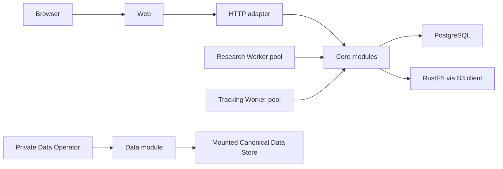
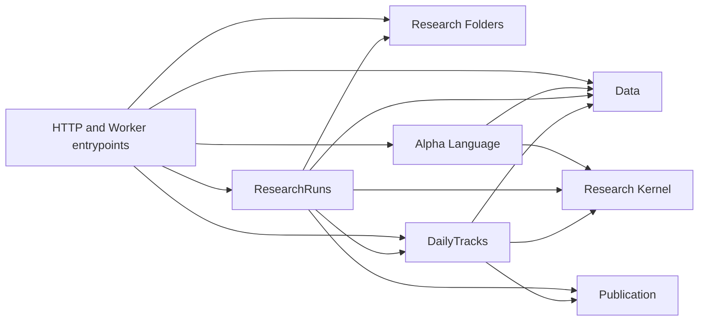

# ThesisTrace Core Architecture

> Status: current module-first product boundary plus the accepted long-run
> executor target from ADR-0194 through ADR-0211. Those executor sections are
> not current runtime behavior until implementation and acceptance verification
> complete.

## Product boundary

ThesisTrace currently closes one local, single-operator research loop:

```text
Data Operator prepares the current Dataset Head
    -> Data Overview exposes current coverage read-only
    -> author one browser-local Draft inside a Research Folder
    -> Run compiles and atomically admits one immutable ResearchRun
    -> a ResearchRun Attempt pins the Generation frozen at admission
    -> immutable Factor and Strategy Result
    -> optionally start a DailyTrack
    -> later market sessions advance that Track
```

The user-visible resources are Data Overview, Research Folders, Research
(ResearchRuns), and DailyTracks. Browser Draft is local authoring state rather
than a server resource. Data Generation, execution Attempt, Tracking Checkpoint,
Working Cache, publication manifest, and schema fingerprint are implementation
concepts, not additional product resources.

Login, tenancy, collaboration, hosted deployment, and production operations are
not part of the active system. There is no Local/Hosted product mode.

## Runtime topology

One Compose topology contains Web, API, fixed-role Research and Tracking Worker
pools, PostgreSQL, RustFS, and a one-shot schema initializer. Both Worker roles
start from the same Production Image and executable. Persistent Development and
disposable Test use the same product implementation with different Compose
identities, ports, volumes, and data mounts.



PostgreSQL stores product lifecycle state, action receipts, attempts, data
operation state, pins, and publication manifests. RustFS stores immutable
ResearchRun and DailyTrack publication bytes. The mounted Canonical Data Store
contains the current Dataset Head and immutable-while-referenced Data Generation
files. No runtime downloads data during API or Worker startup.

## Modules and dependency direction

```text
src/thesistrace/
├── alpha_language/
├── data/
├── research_folder/
├── research_run/
├── daily_track/
├── research_kernel/
├── publication/
├── entrypoints/
└── _postgres/
```

Each product module owns its rules, PostgreSQL schema, SQL, lifecycle state, and
product projection. HTTP and Worker entrypoints are adapters; they do not own
product sequencing. The Research Kernel is pure and knows no product IDs,
PostgreSQL, S3, HTTP, Worker, or Data Operator concepts.



Cross-module writes happen only through explicit private interfaces inside one
concrete PostgreSQL transaction. Product modules do not reach into another
module's tables to implement product rules.

The private `_postgres` package owns the connection pool, concrete transaction
helper, and current-schema initializer/verifier. It contains no domain SQL and
offers no migration history or compatibility machinery.

## Schema lifecycle

The active checkout defines exactly five product schemas:

```text
publication
data
research_folders
research_runs
daily_tracks
```

Their complete current definitions live in each module's `schema.sql`.
Initialization is allowed only when none of the product schemas or
`thesistrace_meta` exists. The initializer creates the schemas and records one
fingerprint of the complete contract in `thesistrace_meta.schema_contract`.

API, Worker, and Data Operator startup verify the exact schema set and
fingerprint. Partial state or a mismatch fails immediately. Development fixes a
mismatch with the destructive `pnpm dev:reset`; Test always starts from an empty
isolated database. There is no upgrade, downgrade, fallback, or compatibility
path.

## Data

The product interface is read-only:

```text
GET /api/data -> coverage, data-through session, last refresh, readiness
```

Bootstrap, Refresh, inspection, work execution, and garbage collection belong
to the deployment-private `thesistrace-data-operator` command. They are not HTTP
routes or Web actions.

Bootstrap creates the first complete Data Generation and Dataset Head. Refresh
collects a bounded overlap plus new completed sessions, builds and validates a
candidate beside the active Generation, and atomically moves the Head only if
the expected Head is still current. Failure leaves the previous Head readable.

An active execution pins one Data Generation. Garbage collection retains the
current Head, live candidates, and active pins; completed Results and Tracking
state do not promise permanent retention of their input market-data bytes.

Tushare is the live source adapter. Replay is the deterministic operator and
test adapter. Neither source adapter owns product IDs, lifecycle state, or the
Dataset Head transition.

## Research authoring

The Alpha Language exposes one read-only Catalog and authoritative Formula
Diagnostics. Authoring state is one browser-local Draft per Research Folder.
It may remain incomplete and has no server identity, Revision, or audit
authority. Run submits one complete Draft for compilation and admission.

```text
GET  /api/alpha/catalog
POST /api/alpha/diagnostics
GET  /api/research-folders
POST /api/research-runs (complete Draft snapshot, Folder, request ID)
```

The backend compiler is the single Formula authority. Run validates Formula,
Research Period, selected Universe, Data availability, structural limits, and
the smallest semantics-preserving execution slice's peak footprint before any
durable mutation. Total historical work informs progress and duration guidance
but does not reject an otherwise safe Run. Admission then freezes the submitted
Formula, canonical Alpha Expression, field bindings, research question,
calculation contracts, and bounded Chunk plan while atomically admitting a
queued ResearchRun with the selected Data Generation and durable Generation
retention. Claim replaces that retention with an Attempt pin before opening any
physical data.

The same request ID and fingerprint returns the original outcome. Reusing the
ID with different input is a conflict. Rejection returns source-ranged
Diagnostics and creates neither a ResearchRun nor an admission receipt. Run
does not clear the browser Draft.

## ResearchRuns

ResearchRun creation is available only through direct Run admission.

```text
queued -> running -> succeeded | failed
queued -> cancelled
running -> cancelling -> cancelled
```

When an Attempt starts, it atomically pins the Data Generation frozen at Run
admission. The pin remains fixed for the complete calculation even if Refresh
moves the Dataset Head concurrently. The Worker executes contiguous complete-
Universe session Chunks sequentially, commits private integrity-checked
Checkpoints, carries only bounded continuation state, and releases completed
Alpha, Label, and daily Factor histories. An eligible infrastructure retry pins
the same frozen Generation and resumes only from the latest valid Checkpoint;
unchecked partial outputs are never combined or published.

`Use as Draft` is the sole reuse action. It copies frozen authorable input into
one selected Folder's browser-local Draft and creates no server state. A later
ordinary Run creates an independent ResearchRun. Mutable Research name and
Folder membership stay outside immutable execution input.

A succeeded Run exposes one immutable Result containing bounded Factor
summaries, Strategy metrics and daily observations, benchmark results, terminal
Strategy state, and provenance. Publication failure cannot expose a partial
Result or mark the Run succeeded. Cancel fences publication immediately and
enters `cancelling`; it reaches terminal `cancelled` only after execution has
stopped and the Generation pin is released.

## DailyTracks

A succeeded ResearchRun can activate at most one DailyTrack. Activation freezes
the complete Tracking Origin and initial Strategy state. The current product
permits at most ten non-stopped Tracks; terminally stopped Tracks do not count.

```text
active | blocked | stopping | stopped
```

An active Track compares its latest successful session coordinate with the
current Dataset Head and advances later Research Sessions in order. Each
Tracking Advance freezes an exact capacity-planned Target containing the oldest
1 through 64 unpublished sessions. Every Attempt retains that Target and pins
one current Data Generation for its complete calculation. Only a complete
immutable Checkpoint moves the Tracking Head to the Target boundary. Longer
catch-up and Dataset Head growth use later Advances rather than changing work
already accepted by an existing Advance.

A Tracking Attempt Cycle contains one initial Attempt plus at most two automatic
Attempts for transient infrastructure failure. Retry delays of 5 then 30 seconds
return the Advance to the fair Tracking queue; permanent data, calculation,
domain, integrity, equivalence, or capacity failure blocks immediately. Every
Attempt starts from the unchanged Head, resolves and pins the then-current Data
Generation, and recalculates the complete frozen Target. Only explicit user
Retry starts another Cycle; later data, capacity, or service lifecycle changes
do not unblock the Track.

Tracking Progress exposes authoritative Head and lag, frozen Target, Attempt
position within the current Cycle, retry waiting state, and transient phase and
current session. It never reports an in-flight session as durably completed.

Stop is irreversible. A Track with no active execution stops immediately. A
running Track first becomes `stopping`; its supervisor fences and ends the child
within the five-second total budget, then releases the Generation Pin and
records terminal `stopped`. A no-child Stop atomically cancels its unresolved
Advance, Cycle, retry eligibility, and pending claim. A `stopping` Track still
counts toward the limit.

The five-second Stop budget applies while the owning supervisor is alive. If
the supervisor, container, or host is lost, durable `stopping` and fencing
remain until lease recovery proves the old execution and Pin ownership can no
longer be live; safety takes priority over that normal-path time bound.

The Working Cache is a private, bounded, disposable optimization and never a
recovery truth. It derives only from the authoritative Tracking Head; failed
Attempt state is discarded. Missing or invalid cache state is rebuilt from that
Head plus the bounded Canonical Data dependency slice needed to continue exactly.
Every Tracking Worker also reconciles its cache against authoritative active and
blocked Track IDs; stopping state owns no new cache writes, and terminal Stop
deletes the disposable cache.

## Research Kernel and Publication

The Research Kernel owns Alpha evaluation, label maturation, Factor aggregation,
Strategy transitions, numeric semantics, and deterministic ordering. Its Run
and Advance paths share one implementation of those rules. Operators form a
closed append-only catalog; there is no runtime plugin or arbitrary Python/SQL
execution.

The runtime executes one current calculation kernel and Numeric Execution
Contract. Product State records that identity, and a result-changing update
refuses old Product State until an explicit Development Product State Reset.
There is no Tracking Generation branch, historical contract dispatcher, or
automatic contract migration.

Publication is the shared module for immutable ResearchRun Results and
DailyTrack Checkpoints. It hides canonical serialization, checksums,
content-addressed S3 keys, manifest recording, verified reads, and orphan-safe
failure behavior.

Publication order is fixed:

1. Canonically serialize and hash every payload.
2. Upload immutable bytes to their content-addressed keys.
3. In one PostgreSQL transaction, record the manifest and move the owning
   module's fenced lifecycle reference.
4. Treat the publication as visible only after commit.

An uploaded object followed by a PostgreSQL failure is invisible and may be
collected later. Readers start from the PostgreSQL reference and verify every
referenced object.

## Product routes

```text
/data
/research
/research-runs
/research-runs/:runId
/daily-tracks
/daily-tracks/:trackId
```

The Web modules own page-local loading, errors, refresh, and actions. The HTTP
adapter maps typed requests to module interfaces. It does not expose Data
Operator controls, physical paths, S3 keys, manifests, SQL fields, Attempt
administration, authentication, or deployment modes.

## Workers

Durable PostgreSQL state is work acceptance. Each Worker process freezes one
role at startup and has exactly one execution slot. A Research Worker claims
only the strict-FIFO ResearchRun Queue and supervises at most one execution child
that runs one ResearchRun's Chunks sequentially. A Tracking Worker claims only
Tracking Advance work and supervises at most one execution child. The two pools
scale independently; a Worker never changes roles, executes both work types, or
selects an execution mode according to work size.

The Research Worker supervisor owns the Attempt lease, fence, Data Generation
Pin, Checkpoints, and publication. Its execution child can read only the frozen
mounted Canonical Data Generation and return bounded Chunk data; it has no
PostgreSQL or RustFS write authority. The supervisor validates every child result
against current ownership before committing it.

The Tracking Worker uses the same authority boundary: its supervisor owns the
Advance, Pin, Working Cache, Tracking Checkpoint, and publication, while its
single child has only read access to the frozen Canonical Data Generation and
returns bounded calculation data.

Eligible DailyTracks rotate fairly. A Track receives at most one Advance
Attempt before returning behind other eligible Tracks, including after a
successful bounded Advance that leaves more lag. Transient retries use their
durable next-eligible time and rejoin the same rotation; multiple Tracking
Workers may claim different Tracks but never the same Track concurrently.
Waiting and backoff belong to the Advance and Cycle. An Attempt is created in
`running` only when a Tracking Worker claims one eligible execution.

One Attempt creates exactly one child. A Research child handles Chunks
sequentially and waits after each result until the supervisor durably commits and
acknowledges its checkpoint. A Tracking child calculates from the authoritative
Tracking Head and returns one all-or-nothing Advance result without a private
checkpoint. Attempt end or supervisor-connection loss ends the child; a child
never crosses into another Attempt.

When idle, either role may reclaim at most one pending shared Publication object
per poll under the Publication mutation fence. Only the Tracking Worker
reconciles Tracking Working Caches. Shared maintenance never creates another
execution slot or a third Worker role.

Development runs one 2-vCPU, 2-GiB replica in each pool. Each pool has its own
deployment capacity declaration, and both planners reserve 25 percent of the
container memory outside their execution budget. Production owns each pool's
capacity and replica count. ResearchRuns and DailyTracks claim and fence their
own Attempts; there is no Temporal, outbox relay, event bus, global job table,
or generic dispatch interface.

## Verification

The active local gates are documented in the
[local lifecycle guide](../runbook/local-lifecycle.md):

1. `bun run test` runs fast host checks.
2. `bun run test:integration` exercises real PostgreSQL and RustFS in
   a fresh isolated Compose Test project.
3. `bun run test:e2e` drives the complete browser loop against a fresh
   topology.
4. `bun run test:image-smoke` qualifies the built application images.
5. `bun run test:benchmark` qualifies both long Research Kinds in the final
   image under the declared Worker envelope.
6. `bun run check` is the ordinary merge gate; `bun run check:release` adds
   image smoke and long-Research qualification.

Live Tushare credential verification is a separate explicit gate. Local checks
are not Production readiness.

## Deliberately absent

- Schema migration, compatibility, fallback, or downgrade paths.
- User-facing Dataset Release history or Data Refresh controls.
- Login, users, tenants, workspaces, quotas, collaboration, or billing.
- Hosted deployment, Temporal, event relay, generic scheduler, or event bus.
- SQLite Product State or a second runtime implementation.
- Tracking Generation branches, multi-contract dispatch, or contract migration.
- Raw artifact browsers, physical object paths, or internal lifecycle pages.
- Server Definitions, visible Revisions, Save, authoring Refresh, or product
  Rerun endpoints and compatibility paths.

The current domain vocabulary is defined in [`CONTEXT.md`](../../CONTEXT.md).
Operator commands are documented in the
[Data Operator runbook](../runbook/data-operator.md).
