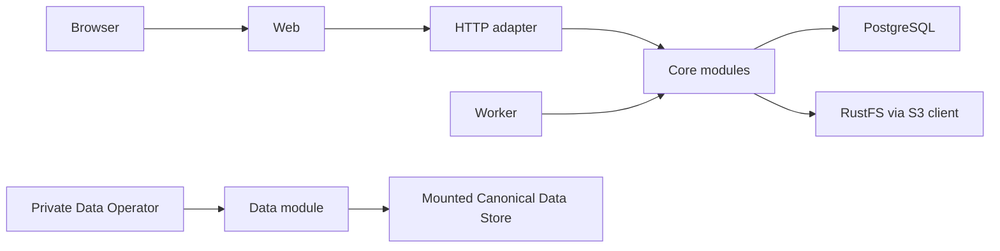
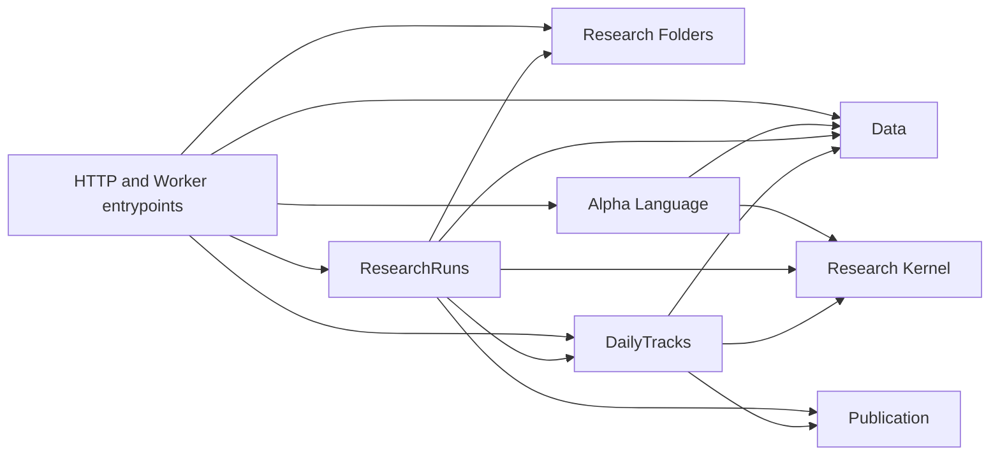

# ThesisTrace Core Architecture

> Status: current module-first Core architecture.

## Product boundary

ThesisTrace currently closes one local, single-operator research loop:

```text
Data Operator prepares the current Dataset Head
    -> Data Overview exposes current coverage read-only
    -> author one browser-local Draft inside a Research Folder
    -> Run compiles and atomically admits one immutable ResearchRun
    -> a ResearchRun Attempt pins the current Data Generation
    -> immutable Factor and Strategy Result
    -> optionally start a DailyTrack
    -> later market sessions advance that Track
```

The user-visible resources are Data Overview, Research Folders, Research
(ResearchRuns), and DailyTracks. Browser Draft is local authoring state rather
than a server resource. Data Generation, execution Attempt, Tracking Checkpoint,
Working Cache, publication manifest, and schema fingerprint are implementation
concepts, not additional product resources.

Login, tenancy, collaboration, hosted deployment, and production operations are
not part of the active system. There is no Local/Hosted product mode.

## Runtime topology

One Compose topology contains Web, API, Worker, PostgreSQL, RustFS, and a
one-shot schema initializer. Persistent Development and disposable Test use the
same product implementation with different Compose identities, ports, volumes,
and data mounts.



PostgreSQL stores product lifecycle state, action receipts, attempts, data
operation state, pins, and publication manifests. RustFS stores immutable
ResearchRun and DailyTrack publication bytes. The mounted Canonical Data Store
contains the current Dataset Head and immutable-while-referenced Data Generation
files. No runtime downloads data during API or Worker startup.

## Modules and dependency direction

```text
src/thesistrace/
├── alpha_language/
├── data/
├── research_folder/
├── research_run/
├── daily_track/
├── research_kernel/
├── publication/
├── entrypoints/
└── _postgres/
```

Each product module owns its rules, PostgreSQL schema, SQL, lifecycle state, and
product projection. HTTP and Worker entrypoints are adapters; they do not own
product sequencing. The Research Kernel is pure and knows no product IDs,
PostgreSQL, S3, HTTP, Worker, or Data Operator concepts.



Cross-module writes happen only through explicit private interfaces inside one
concrete PostgreSQL transaction. Product modules do not reach into another
module's tables to implement product rules.

The private `_postgres` package owns the connection pool, concrete transaction
helper, and current-schema initializer/verifier. It contains no domain SQL and
offers no migration history or compatibility machinery.

## Schema lifecycle

The active checkout defines exactly five product schemas:

```text
publication
data
research_folders
research_runs
daily_tracks
```

Their complete current definitions live in each module's `schema.sql`.
Initialization is allowed only when none of the product schemas or
`thesistrace_meta` exists. The initializer creates the schemas and records one
fingerprint of the complete contract in `thesistrace_meta.schema_contract`.

API, Worker, and Data Operator startup verify the exact schema set and
fingerprint. Partial state or a mismatch fails immediately. Development fixes a
mismatch with the destructive `pnpm dev:reset`; Test always starts from an empty
isolated database. There is no upgrade, downgrade, fallback, or compatibility
path.

## Data

The product interface is read-only:

```text
GET /api/data -> coverage, data-through session, last refresh, readiness
```

Bootstrap, Refresh, inspection, work execution, and garbage collection belong
to the deployment-private `thesistrace-data-operator` command. They are not HTTP
routes or Web actions.

Bootstrap creates the first complete Data Generation and Dataset Head. Refresh
collects a bounded overlap plus new completed sessions, builds and validates a
candidate beside the active Generation, and atomically moves the Head only if
the expected Head is still current. Failure leaves the previous Head readable.

An active execution pins one Data Generation. Garbage collection retains the
current Head, live candidates, and active pins; completed Results and Tracking
state do not promise permanent retention of their input market-data bytes.

Tushare is the live source adapter. Replay is the deterministic operator and
test adapter. Neither source adapter owns product IDs, lifecycle state, or the
Dataset Head transition.

## Research authoring

The Alpha Language exposes one read-only Catalog and authoritative Formula
Diagnostics. Authoring state is one browser-local Draft per Research Folder.
It may remain incomplete and has no server identity, Revision, or audit
authority. Run submits one complete Draft for compilation and admission.

```text
GET  /api/alpha/catalog
POST /api/alpha/diagnostics
GET  /api/research-folders
POST /api/research-runs (complete Draft snapshot, Folder, request ID)
```

The backend compiler is the single Formula authority. Run validates Formula,
Research Period, selected Universe, Data availability, and work budget before
any durable mutation, then freezes the submitted Formula, canonical Alpha
Expression, field bindings, research question, and calculation contracts while
atomically admitting a queued ResearchRun. Data Generation selection belongs to
Attempt start.

The same request ID and fingerprint returns the original outcome. Reusing the
ID with different input is a conflict. Rejection returns source-ranged
Diagnostics and creates neither a ResearchRun nor an admission receipt. Run
does not clear the browser Draft.

## ResearchRuns

ResearchRun creation is available only through direct Run admission.

```text
queued -> running -> succeeded | failed
queued | running -> cancelled
```

When an Attempt starts, it atomically selects and pins the then-current Data
Generation. The pin remains fixed for the complete calculation even if Refresh
moves the Dataset Head concurrently. A retry starts a new Attempt, selects the
then-current Head, and recomputes from the beginning; partial outputs from
different Generations are never combined.

`Use as Draft` is the sole reuse action. It copies frozen authorable input into
one selected Folder's browser-local Draft and creates no server state. A later
ordinary Run creates an independent ResearchRun. Mutable Research name and
Folder membership stay outside immutable execution input.

A succeeded Run exposes one immutable Result containing bounded Factor
summaries, Strategy metrics and daily observations, benchmark results, terminal
Strategy state, and provenance. Publication failure cannot expose a partial
Result or mark the Run succeeded. Cancel commits durable terminal state first;
fencing rejects late Worker publication.

## DailyTracks

A succeeded ResearchRun can activate at most one DailyTrack. Activation freezes
the complete Tracking Origin and initial Strategy state. The current product
permits at most ten active or blocked Tracks; stopped Tracks do not count.

```text
active | blocked | stopped
```

An active Track compares its latest successful session coordinate with the
current Dataset Head and advances later Research Sessions in order. Each
Tracking Advance Attempt pins one current Data Generation. Only a complete
immutable Checkpoint moves the Tracking Head. A concurrent Data Refresh is
handled by later work rather than by mixing Generations inside one Attempt.

After bounded retries are exhausted, a Track becomes blocked and retains its
last successful Head. Retry continues from that Head. Stop is irreversible.

The Working Cache is a private, bounded, disposable optimization. PostgreSQL
state and immutable Checkpoints remain authoritative. Missing or invalid cache
state is rebuilt; each Worker reconciles its own cache against authoritative
active and blocked Track IDs, removing stopped or deleted Track entries even
when API and Worker use separate cache roots.

## Research Kernel and Publication

The Research Kernel owns Alpha evaluation, label maturation, Factor aggregation,
Strategy transitions, numeric semantics, and deterministic ordering. Its Run
and Advance paths share one implementation of those rules. Operators form a
closed append-only catalog; there is no runtime plugin or arbitrary Python/SQL
execution.

Publication is the shared module for immutable ResearchRun Results and
DailyTrack Checkpoints. It hides canonical serialization, checksums,
content-addressed S3 keys, manifest recording, verified reads, and orphan-safe
failure behavior.

Publication order is fixed:

1. Canonically serialize and hash every payload.
2. Upload immutable bytes to their content-addressed keys.
3. In one PostgreSQL transaction, record the manifest and move the owning
   module's fenced lifecycle reference.
4. Treat the publication as visible only after commit.

An uploaded object followed by a PostgreSQL failure is invisible and may be
collected later. Readers start from the PostgreSQL reference and verify every
referenced object.

## Product routes

```text
/data
/research
/research-runs
/research-runs/:runId
/daily-tracks
/daily-tracks/:trackId
```

The Web modules own page-local loading, errors, refresh, and actions. The HTTP
adapter maps typed requests to module interfaces. It does not expose Data
Operator controls, physical paths, S3 keys, manifests, SQL fields, Attempt
administration, authentication, or deployment modes.

## Worker

Durable PostgreSQL state is work acceptance. The Worker polls module-owned work
every five seconds. ResearchRuns and DailyTracks claim and fence their own
Attempts; there is no Temporal, outbox relay, event bus, global job table, or
generic dispatch interface.

## Verification

The active local gates are documented in the
[local lifecycle guide](../runbook/local-lifecycle.md):

1. `bun run test` runs fast host checks.
2. `bun run test:integration` exercises real PostgreSQL and RustFS in
   a fresh isolated Compose Test project.
3. `bun run test:e2e` drives the complete browser loop against a fresh
   topology.
4. `bun run test:image-smoke` qualifies the built application images.
5. `bun run check` is the ordinary merge gate; `bun run check:release` adds
   image qualification.

Live Tushare credential verification is a separate explicit gate. Local checks
are not Production readiness.

## Deliberately absent

- Schema migration, compatibility, fallback, or downgrade paths.
- User-facing Dataset Release history or Data Refresh controls.
- Login, users, tenants, workspaces, quotas, collaboration, or billing.
- Hosted deployment, Temporal, event relay, generic scheduler, or event bus.
- SQLite Product State or a second runtime implementation.
- Raw artifact browsers, physical object paths, or internal lifecycle pages.
- Server Definitions, visible Revisions, Save, authoring Refresh, or product
  Rerun endpoints and compatibility paths.

The current domain vocabulary is defined in [`CONTEXT.md`](../../CONTEXT.md).
Operator commands are documented in the
[Data Operator runbook](../runbook/data-operator.md).
