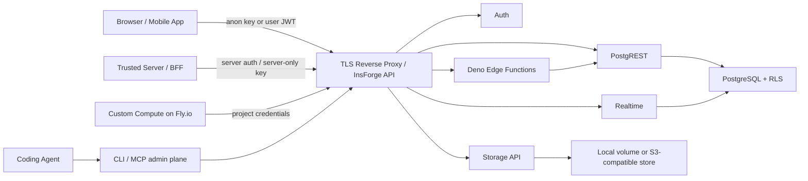
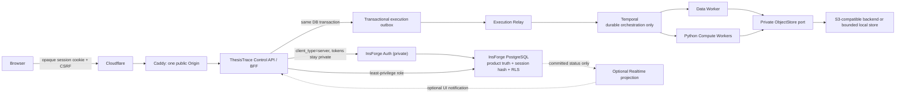

# InsForge 使用场景、产品边界与 ThesisTrace 集成架构调研

日期：2026-08-03
对象：**InsForge**（用户问题中的 `insofrge` / `insforge` 均指此产品）
证据范围：InsForge 官方文档、官方 GitHub 仓库、官方发布说明，以及当前
ThesisTrace 工作树。外部事实只引用一手来源。

## 结论先行

1. **InsForge 是 agent-native BaaS，不是通用持久工作流引擎。**它把
   PostgreSQL、PostgREST、Auth、Storage、Realtime、Deno Edge Functions、
   AI key provisioning 等能力放在统一 JWT、RLS、SDK、CLI/MCP 表面后面。其核心价值是
   快速提供安全的数据与应用后端原语，而不是接管应用自己的领域模型、租户模型、
   调度语义或计算内核。[官方产品总览](https://docs.insforge.dev/products)
2. 官方文档隐含的“最佳架构”不是“所有逻辑都写成 Edge Function”，而是按执行
   形态分层：**普通行级 CRUD → Database；运行一次即结束的自定义逻辑 → Edge
   Function；常驻进程 → Custom Compute**。[官方 FAQ](https://docs.insforge.dev/faq)
3. 对普通 CRUD / 实时协作型 Web 或移动应用，官方默认的浏览器/客户端直连
   SDK + JWT + RLS 架构最省工程量。对具有复杂领域不变量、需要撤销式应用会话、
   不希望客户端持有上游 token 的系统，官方 Auth REST API 又明确支持
   `client_type=server`，即可信服务端、SSR 和 BFF。[Auth REST 文档](https://docs.insforge.dev/sdks/rest/auth)
4. **ThesisTrace 最合适的是 BFF/Control API 混合架构**：InsForge 负责身份源和
   PostgreSQL 基础设施；ThesisTrace Control API 是唯一浏览器产品边界；
   PostgreSQL 保存产品真相并以专用角色/RLS 做第二道隔离；事务 outbox 连接
   Temporal；Temporal 与 Python Workers 负责持久编排和重计算；不可变对象只经
   私有 `ObjectStore` 端口访问。Edge Functions、Realtime、Custom Compute、
   Model Gateway 都不应为了“用全 InsForge”而进入首发关键路径。
5. 当前工作树已经固定官方最新发行版 **v2.2.9**（commit
   `baff3e7925430e8779f55b0687d0cf13fe5ab270`），并在构建镜像时施加 ThesisTrace
   的 JWT contract patch；该 tag 与 2026-07-28 的官方 latest
   release 一致。[v2.2.9 发布页](https://github.com/InsForge/InsForge/releases/tag/v2.2.9)
   但当前代码仍是浏览器持有 access token、Control API 校验 Bearer JWT；
   ADR-0150 所定义的 BFF Auth Session 尚未落实到代码。不能把目标设计写成已完成
   事实。

## 1. 版本与证据边界

### 1.1 当前版本

- 官方 GitHub Releases 在检查日把 `v2.2.9` 标为 Latest，签名 commit 是
  `baff3e7`；发布内容包括自托管 S3 后端、内部端口绑定到 localhost、email OTP
  等。[官方 v2.2.9 release](https://github.com/InsForge/InsForge/releases/tag/v2.2.9)
- ThesisTrace 的 `.hosted/insforge-v2.2.9` checkout 精确位于标签 `v2.2.9` 和完整
  commit `baff3e7925430e8779f55b0687d0cf13fe5ab270`；
  `deploy/hosted/compose.yaml:65-148` 也从该源码构建 InsForge 并挂载其 PostgreSQL
  初始化配置。
- 这不是完全未修改的上游镜像：`deploy/hosted/release.json:31-36` 把
  `deploy/hosted/patches/insforge-v2.2.9-jwt-contract.patch` 纳入发布输入；
  `scripts/hosted-stack:101-104` 在构建前校验/施加它。该 patch 为签发的 JWT 增加
  `issuer=insforge` 和 `audience=thesistrace`，并增加最小 anon-key endpoint。
- InsForge 文档站是滚动更新的。本文用官方 release/tag 校验和 ThesisTrace
  实际 pin，避免把 `main` 上的将来能力当成当前 v2.2.9 合同。

### 1.2 已发现的官方文档冲突与版本漂移

Edge Functions 总览写“定时调用失败会 retry”，但更具体的 Schedules 文档明确写：
失败只记日志、**不重试**，函数必须幂等；v2.2.9 仓库中的
`docs/core-concepts/functions/schedules.mdx` 也保留了后一语义。因此架构判断采用
更具体、且在固定标签内可复核的“不自动重试”合同。

- [Edge Functions 总览](https://docs.insforge.dev/core-concepts/functions/overview)
- [Schedules 专页](https://docs.insforge.dev/core-concepts/functions/schedules)
- [v2.2.9 标签内 Schedules 文档](https://github.com/InsForge/InsForge/blob/v2.2.9/docs/core-concepts/functions/schedules.mdx)

这也是为什么 InsForge Schedule 适合作为幂等 cron 触发器，却不能被视为
ThesisTrace 的持久编排或故障恢复引擎。

AI 文档还暴露了更明显的迁移中状态：高层 Model Gateway 页仍宣传项目
`/v1` OpenAI-compatible proxy，但现行 TypeScript SDK 和 REST 文档明确把
InsForge chat/image/embedding proxy 标记为 deprecated。**新集成应在可信服务端
使用 InsForge provision 的 `OPENROUTER_API_KEY` 直接调 OpenRouter**，不得将 key
放入浏览器。因此本文把 InsForge 的当前 AI 能力视为 key/admin/usage helper，
不把旧 proxy 当成新系统的稳定运行时边界。

- [高层 Model Gateway 总览](https://docs.insforge.dev/core-concepts/ai/overview)
- [现行 TypeScript AI 文档](https://docs.insforge.dev/sdks/typescript/ai)
- [现行 REST AI 文档](https://docs.insforge.dev/sdks/rest/ai)

官方的“multi-region”也需要精确理解：创建项目时从四个 region 中选一个，
数据库、backend 和基础设施部署在所选区域。官方同页把 cross-region
replication 和 automated failover 写成“正在探索”，所以这是**项目选区**，
不是跨区 active-active 或已承诺的自动故障转移。
[官方 multi-region 说明](https://insforge.dev/blog/insforge-multi-region)

## 2. InsForge 到底提供什么

| 能力 | 官方合同 | 清晰边界 |
|---|---|---|
| Database | 每个项目一个 PostgreSQL；表自动成为 typed REST/SDK endpoint；支持普通关系查询、迁移、pgvector、Realtime change feed | 数据 API 是 PostgREST CRUD/RPC 表面，不替应用定义领域不变量、租户模型或跨步骤工作流 |
| Authentication | email/password、magic link/OTP、OAuth/OIDC、JWT session；`auth.users` 位于同一 PostgreSQL | Auth 证明“是谁”；“能做什么”仍由应用模型与 PostgreSQL RLS 决定 |
| Storage | 对象存储、bucket、signed URL、RLS、S3-compatible gateway；结构化元数据应放数据库、bytes 放对象存储 | 不是数据库，也不自动提供应用自己的内容寻址、发布原子性、保留或删除语义 |
| Realtime | WebSocket channel，承载数据库变化、broadcast、presence、webhook fan-out，并可用 RLS 限制 subscribe/publish | 用于把变化交付给在线客户端/外部 webhook；不是 durable queue。官方明确要求 durable membership/roles 仍存应用表，presence 只是在线状态 |
| Edge Functions | Deno/TypeScript；HTTP、cron、DB trigger；有 secrets、env、per-invocation logs | request/response 与短任务。官方明确说常驻进程要用 Compute；schedule 失败不自动重试 |
| Custom Compute | 常驻容器，用于 queue worker、background processor、AI inference loop、WebSocket server 等 | 当前官方 README 标为 private preview；自托管仍需自己的 Fly.io token/org，并非“随 Compose 留在同一节点”的本地容器编排 |
| AI / legacy Model Gateway | 高层页仍描述 OpenAI-compatible project proxy；现行 SDK/REST 已要求新功能在可信服务端持 provisioned key 直调 OpenRouter | 旧 proxy 只是 deprecated compatibility path；key 不得进浏览器，也不替应用提供领域 RAG pipeline、评测、重排或记忆 |
| CLI / MCP / Config as Code | Agent 可读取 schema、metadata、logs，执行迁移、配置资源、诊断；部分配置可存 `insforge.toml` | 是开发/运维控制面，不应成为最终用户请求的运行时授权或产品工作流真相 |

主要一手依据：

- [Database](https://docs.insforge.dev/core-concepts/database/overview)
- [Authentication](https://docs.insforge.dev/core-concepts/authentication/overview)
- [Storage](https://docs.insforge.dev/core-concepts/storage/overview)
- [Realtime](https://docs.insforge.dev/core-concepts/realtime/overview)
- [Edge Functions](https://docs.insforge.dev/core-concepts/functions/overview)
- [Custom Compute](https://docs.insforge.dev/core-concepts/compute/overview)
- [现行 AI integration / pgvector](https://docs.insforge.dev/sdks/typescript/ai)
- [Agent-native initiatives](https://docs.insforge.dev/agent-native/overview)

### 2.1 统一能力的真正中心：身份 + RLS

官方产品总览说 Auth、Database、Storage、Realtime、Edge Functions 共享同一个
JWT 身份与行级策略；Database 文档进一步说明 JWT/RLS 同样约束 REST、SDK、
Realtime 和 Storage。这个统一授权面是 InsForge 最重要的架构收益。

但必须区分三件事：

1. 登录成功只建立 **identity**；
2. 应用仍要建 `workspace_id` / membership / ownership 等产品模型；
3. 每张可被客户端或 SDK 触及的表仍要有正确 privilege 与 RLS policy。

官方 FAQ 说明新建表默认开启 RLS；开启 RLS 而没有 policy 时是 default deny。
它还明确区分 public anon key 与 server-only `ik_...` API key：后者绕过 RLS，
绝不能下发浏览器。[官方 FAQ：RLS 与 API Key](https://docs.insforge.dev/faq)

### 2.2 三种认证拓扑都受官方支持

InsForge 不只支持浏览器直连：

- `client_type=web`：refresh token 在 HttpOnly cookie，响应返回 CSRF token；
- `mobile` / `desktop` / `server`：refresh token 在响应体，调用方必须安全保存并在
  refresh 后持久化新 token；
- 官方专门写明 `server` 用于 trusted server-side caller、SSR、BFF 或 CLI。

因此 BFF 是一等接口形态，不是绕开 SDK 的非标准做法。
[官方 Auth REST API](https://docs.insforge.dev/sdks/rest/auth)

## 3. 典型使用场景

### 3.1 高适配场景

| 场景 | 为什么适配 | 推荐使用的 InsForge 能力 |
|---|---|---|
| 中小型 SaaS、管理后台、会员/内容/订单应用 | 关系数据、登录、文件、RLS 是主需求；CRUD 可直接生成 | Auth + Database + RLS + Storage；必要时 Edge Function |
| Web / iOS / Android 多端应用 | 官方有 TypeScript、Swift、Kotlin 与 REST 表面，身份/RLS 一致 | SDK + Auth + Database/Storage |
| 聊天、协作、订单状态、在线 presence | WebSocket channel、database change、broadcast、presence、webhook 已打包 | Realtime；持久 membership 与权限仍放数据库 |
| Webhook、支付回调、轻量 BFF、自定义 endpoint | 逻辑按请求/事件运行后结束，不需要常驻 | Edge Function；写入必须幂等 |
| 每分钟及以上的简单 cron | pg_cron 触发 HTTP Function 并记录结果 | Schedule + 幂等 Edge Function；自行处理重试/补偿 |
| RAG/语义检索原型或中等规模 AI 应用 | PostgreSQL + pgvector + 可信服务端模型调用可以快速闭环 | pgvector + RPC + server-side direct OpenRouter；生产级 pipeline 仍配专门编排 |
| Agent 辅助全栈开发 | MCP/CLI 能读真实 schema/logs/metadata 并执行迁移和诊断 | CLI/MCP + SQL migrations + config plan/apply |
| 需要开源自托管且单机可接受 | 官方提供 Docker Compose、VPS、AWS/Azure/GCP 指南 | 版本固定的 Compose + TLS reverse proxy + 私网服务 + 备份 |

框架示例与官方 cookbook 覆盖 Next.js、React、Vue、Nuxt、Svelte；这进一步说明其
默认重心是给前端/移动应用快速提供完整 BaaS，而不是替换所有专用后端。
[官方 examples](https://docs.insforge.dev/examples/overview)

### 3.2 不适用或不应单独承担的场景

以下判断中，“官方事实”来自所列来源；“不适用”是基于该事实做的架构推论。

| 场景 | 为什么不应让 InsForge 单独承担 | 合适补充 |
|---|---|---|
| 长时间、多步骤、可恢复、需要 retry/timeout/cancel/history 的工作流 | Schedule 失败不重试；Edge Function 是短任务；官方没有给出 durable workflow history/fair queue 合同 | Temporal、Cadence 或其他工作流引擎；InsForge PostgreSQL 只保存产品真相与 outbox |
| 重 CPU/内存、Python/Arrow/Parquet 量化计算 | Edge Function 是 Deno/TypeScript 短任务；Custom Compute 才是常驻容器，但自托管 Compute 依赖 Fly.io | 自有 Python Worker、Kubernetes/Batch、Temporal Activity 等 |
| 把 Realtime 当任务队列或唯一事件真相 | Realtime 面向在线交付与 webhook；presence 不是 durable membership；message history 也不是应用工作流状态机 | 事务 outbox + durable broker/workflow；Realtime 只做提交后的投影通知 |
| 仅靠登录实现多租户 | 官方明确 Auth 与 Authorization 分离；RLS policy 才决定行级权限 | 应用自己的 tenant/workspace/membership 表 + RLS + API 校验 |
| 让浏览器持有 `ik_...` 或 PostgreSQL privileged connection | `ik_...` 和 cloud PostgreSQL connection 都绕过 RLS，官方要求 server-only | anon/JWT + RLS，或 BFF 使用最小权限专用角色 |
| 严格 HA、零停机、明确 RPO/RTO | 自托管基线是一个 VPS 上四个 Compose 服务，未承诺 HA；Cloud 的 multi-region 是单项目选区，跨区复制/自动 failover 仍在探索 | 另行设计/采购 HA PostgreSQL、对象存储、备份恢复、故障转移与监控 |
| 用默认本地 volume 直接承载生产对象而没有恢复设计 | 官方称 local filesystem 最适合试用；生产推荐外部 S3-compatible store 或同机 MinIO/RustFS；还要求 off-site backup | 外部 S3/兼容对象存储，或经过恢复演练的单机对象服务 |
| 需要完整 S3 企业治理 | InsForge S3 gateway 不支持 versioning、SSE-C/KMS、ACL、object lock、tagging、lifecycle 和 CORS；长期 key 是 project-admin 级 | 直接使用满足所需合同的 S3 provider，上层仍经应用 ObjectStore port |
| 复杂领域系统把浏览器直接开放到所有自动 CRUD | 自动 CRUD 不能自然强制跨资源、跨步骤的产品不变量；admin key 又会绕过 RLS | Control API/BFF；数据库 RLS 作为第二道边界，而非唯一业务层 |

依据：

- [Database / Edge Function / Custom Compute 选型矩阵](https://docs.insforge.dev/faq)
- [Schedules 限制](https://docs.insforge.dev/core-concepts/functions/schedules)
- [Realtime 边界](https://docs.insforge.dev/core-concepts/realtime/overview)
- [Custom Compute 与自托管 Fly 依赖](https://docs.insforge.dev/core-concepts/compute/overview)
- [自托管存储选项](https://docs.insforge.dev/deployment/self-host-storage)
- [S3 gateway 功能限制](https://docs.insforge.dev/core-concepts/storage/s3-compatibility)
- [Cloud 项目选区与未来跨区能力](https://insforge.dev/blog/insforge-multi-region)
- [VPS 部署、安全、备份、更新与回滚](https://docs.insforge.dev/deployment/deployment-security-guide)

## 4. 官方明确或隐含推荐的参考架构

### 4.1 普通应用的逻辑架构



这张图表达的是官方文档的组合关系，不代表所有应用都要启用全部产品。

请求落点应按以下次序决定：

1. 只是读写一张表：Database REST/SDK + RLS；
2. 需要一个短时服务端事务、webhook、外部 API 调用或 DB trigger：Edge Function；
3. 需要持续运行、保持状态或消费队列：Custom Compute 或外部 worker；
4. 需要跨步骤持久恢复：在 InsForge 之外增加工作流引擎；
5. 只需要通知 UI：Realtime；不要把通知通道升格为产品真相。

### 4.2 自托管物理拓扑

官方 VPS 指南把核心自托管运行时定义为四个共同运行的服务：

```text
Reverse proxy (public 443)
    -> InsForge Node backend/dashboard :7130
        -> PostgREST :3000 -> PostgreSQL :5432
        -> Deno runtime :7133
        -> local STORAGE_DIR or S3-compatible backend
```

官方还要求：

- 只开放 SSH、80、443；PostgreSQL、PostgREST、InsForge、Deno 内部端口不直接公网
  暴露；
- 反向代理终止 TLS 并支持 WebSocket；
- `JWT_SECRET` 与 `ENCRYPTION_KEY` 分离，生产凭据替换默认值；
- 固定/记录版本，升级前备份，支持回滚；数据库、env、volumes 进入备份，另做
  off-site copy；
- 默认本地对象 volume 只适合快速开始；生产可以接外部 S3-compatible store，或
  同机内部网络的 MinIO/RustFS；私网对象端点用 proxy mode。

来源：

- [VPS deployment and security guide](https://docs.insforge.dev/deployment/deployment-security-guide)
- [Self-hosted storage backends](https://docs.insforge.dev/deployment/self-host-storage)
- [官方 GitHub README / self-hosted Compose](https://github.com/InsForge/InsForge)

### 4.3 Cloud 与 self-host 的选择

| 选择 | 适合 | 代价/注意 |
|---|---|---|
| InsForge Cloud | 追求最快上线、少运维、希望托管 Compute/Sites | 项目只选一个 region，不是跨区 HA；AI 新集成直调外部 OpenRouter；需要确认 plan、数据治理与容量合同 |
| 官方原样 self-host Compose | 数据控制、开源、一个项目一套后端、单机可接受 | 自己负责 TLS、SMTP、升级、数据库/对象/secret 备份、恢复与可用性 |
| 嵌入已有产品栈 | 已有 BFF、工作流和 worker，只想复用 Auth/PostgreSQL/Storage 原语 | 必须明确哪些 API 对外、谁持有 admin key、谁拥有 migrations、RLS 与升级兼容性 |

不存在“把现有复杂后端全部改成 Edge Functions”这个官方最佳实践；官方自己的 FAQ
正是为了纠正这种混淆。

## 5. ThesisTrace 当前架构事实

以下是当前工作树证据，不代表线上生产状态：

1. `deploy/hosted/compose.yaml:65-415` 运行 InsForge v2.2.9 的 PostgreSQL、
   PostgREST、Deno、InsForge backend；`99-239` 另有独立 Temporal PostgreSQL 与
   Temporal Service。
2. `deploy/hosted/compose.yaml:417-725` 另有私有 ObjectStore、FastAPI、execution
   relay、Data Worker 和四个 Python Compute Worker；Workers 有独立 Unix user、
   DB credential、网络、CPU/RAM 与对象访问 token。当前 bulk research bytes
   经 `object-store:8010` 访问 `immutable-objects` volume，**没有经 InsForge
   Storage**。
3. `deploy/hosted/Caddyfile:27-61` 只代理 `/api/v1/*` 和一组明确 allowlist 的
   InsForge Auth 路由，阻断 storage/admin 路由；它没有把 PostgREST、InsForge
   Storage、Deno 或管理后台公开成产品 API。
4. `deploy/hosted/migrations/0004_workspace_isolation.sql:1-126` 创建
   `thesistrace_api` / `compute` / `data` 等非 superuser、非 BYPASSRLS 角色，并把
   verified InsForge subject 映射成当前 Personal Workspace；产品表在
   `thesistrace_product` schema 中保存 `workspace_id`。
5. `docs/adr/0125-use-temporal-for-durable-orchestration-and-fair-dispatch.md` 已明确
   PostgreSQL 是产品真相，事务 outbox 幂等启动 Temporal，Workflow History 只是
   执行状态；`src/thesistrace/hosted/execution_relay.py:65-183` 是当前实现证据。
6. `docs/adr/0141-enforce-workspace-isolation-in-the-api-and-postgresql-rls.md` 要求所有
   产品操作经过 ThesisTrace API，API 派生 Workspace，PostgreSQL RLS 再独立执行
   同一隔离；raw artifacts 与 signed object access 都不是产品面。
7. 当前 auth **仍是 direct-token 形态**：`web/src/hostedAuth.tsx:11-23,98-117`
   在浏览器模块内存保存 access token，调用 `client_type=server` 后把 Bearer token
   加到 `/api/v1/*`；它不持久化 server 响应中的 refresh token，页面上的 logout
   也只清除模块内存与 React state，没有服务端 revoke。
   `src/thesistrace/api.py:325-446` 校验 Bearer JWT；
   `src/thesistrace/auth.py:64-180` 校验 JWKS、issuer、audience、role，并查询
   `auth.users`。
8. `docs/adr/0150-separate-insforge-identity-from-thesistrace-auth-sessions.md` 已选择
   由 Control API 私下调用 InsForge、浏览器只持 opaque Auth Session、服务器存
   session hash 和加密 refresh token。它和第 7 条存在**目标设计/现有实现差距**。

## 6. ThesisTrace 可选集成架构

| 方案 | 形态 | 优点 | 主要问题 | 判断 |
|---|---|---|---|---|
| A. 浏览器直连 InsForge BaaS | Web 持 JWT；直接或经 Caddy 调 Auth/Database/Storage/Realtime | 最贴近普通 InsForge app，SDK 省事 | 浏览器与 InsForge token/API 耦合；难形成统一撤销的产品 Auth Session；直接 CRUD 会绕过 Control API 领域边界 | 不推荐作为 ThesisTrace 目标；当前仅 Auth 部分仍处于这种形态 |
| B. Control API / BFF + InsForge 基础设施 | Browser 只调用 Control API；API 以 `client_type=server` 私下调用 InsForge Auth；产品表由 API/Workers 以专用 DB role 访问 | 保留 InsForge 身份与 PostgreSQL；最小公开面；统一应用会话、审计、配额、领域不变量；与 Temporal/Python 兼容 | 需要自己维护 server-side session、CSRF、token refresh/revocation 边界 | **推荐** |
| C. 全量 InsForge-native 改造 | 浏览器 SDK + PostgREST；业务写 Deno Functions；Workers 搬 Custom Compute | 产品表面统一 | 重写 FastAPI/Python kernel；Edge Function 不具备持久工作流语义；self-host Compute 依赖 Fly；破坏一节点 Compose 与已验证端口 | 不采用 |
| D. InsForge 只做 IdP，产品数据库完全分离 | InsForge Auth DB 与 ThesisTrace PostgreSQL 分库 | 升级/故障域更清楚，减少 InsForge schema 影响 | 两套数据库、备份、身份同步和事务边界；失去同库 FK/RLS 与当前 Compose 简洁性 | 作为未来解耦方案保留，不是首发默认 |

## 7. 推荐的 ThesisTrace 目标架构



### 7.1 责任分配

**InsForge 应负责：**

- 用户注册、密码验证、email verification/recovery、可选 OAuth/OIDC；
- `auth.users` 这一身份源；
- PostgreSQL 物理数据库与基础扩展；
- InsForge 自身 migration、JWKS 和内部服务；
- 可选的 S3-compatible storage adapter、Realtime 通知、CLI/MCP 运维工具，但只有
  在明确需求和验证后才启用。

**ThesisTrace 应负责：**

- 浏览器 Auth Session、CSRF、session revoke、上游 token 加密与 refresh；
- User → Personal Workspace 这一产品映射；
- Research Definition、Run、Track、quota、admission、tombstone、manifest、outbox；
- 所有浏览器可见产品 API 与视图；
- Temporal Workflow、fair dispatch、retry/timeout/cancel/recovery；
- Python/Arrow/Parquet 计算内核；
- 私有不可变对象的内容地址、staging、publication、fencing、retention 与删除语义。

### 7.2 具体边界

1. **公开 HTTP：**Cloudflare → Caddy → Control API。迁移完成后不再让浏览器直接
   调 InsForge Auth；OAuth/email link 若必须回调，Caddy 只 allowlist 最小回调，
   随后回到 Control API 完成应用 session。
2. **认证：**Control API 用官方 `client_type=server` 调 InsForge；refresh token
   只以密文存在服务端；浏览器只持高熵 opaque cookie；应用 logout/revoke 以
   ThesisTrace session 为即时边界。InsForge 仍是唯一凭据/身份源。
3. **数据库：**继续共用一个 InsForge PostgreSQL 实例，但把
   `auth` / InsForge internal schemas 与 `thesistrace_control` /
   `thesistrace_product` 严格分 schema；应用连接使用专用 NOLOGIN/NO-BYPASSRLS
   roles，不用 `ik_...` 或 `postgres` 执行用户请求。
4. **业务 API：**浏览器不直接碰 PostgREST 产品表。自动 REST 仍可供 InsForge
   内部使用，ThesisTrace 产品状态只通过 Control API 的 bounded resource views
   暴露，以免绕过冻结 Definition、配额、幂等、原子 publication 等不变量。
5. **编排：**数据库事务同时写产品状态和 outbox；Relay 只做幂等启动；Temporal
   拥有执行 history/retry/timeout，PostgreSQL 拥有用户可见状态。不得再加一套
   InsForge Schedule/Edge Function scheduler。
6. **对象：**保留 `ObjectStore` port。首发可继续使用受限私有 volume；真正生产
   需要把 bytes 接到外部 S3-compatible store，或验证过恢复的同机 MinIO/RustFS。
   若以后选 InsForge Storage，必须把它作为该 port 的一个 adapter，先验证内容
   地址、staging/publication、原子 manifest、Range、配额、删除与备份恢复；不向
   浏览器开放 signed URL。
7. **Realtime：**只在 UI 确有“无需刷新即更新”的需求时使用。它只发布数据库
   已提交后的状态 ID/version，客户端仍回 Control API 读取权威资源；不能承载
   task claim、重试或 Workflow 真相。
8. **Edge Functions：**首发关键路径为零。未来只适合隔离的小型 webhook 或
   adapter；任何涉及 ResearchRun、Tracking、Publication 的逻辑仍走 API +
   outbox + Temporal。
9. **Custom Compute：**不用于当前一节点 Hosted V2。官方自托管形态要把容器放到
   Fly.io，与现有本地资源 envelope、专用网络/凭据和 Python Worker 验收链不符。
10. **运维：**固定 InsForge tag/digest，升级先对官方 changelog、migrations、
    Compose、patch 做 diff；分别备份 InsForge/Product PostgreSQL、Temporal
    PostgreSQL、对象、secrets/config，并做异机副本与恢复演练。不要把“一节点
    Compose 可启动”说成 HA 或生产 RPO/RTO 已证明。

## 8. 分阶段落地建议

这不是本次实现任务，只是把架构选择转换成可验证顺序：

1. **先收窄 Auth：**实现 ADR-0150 的 PostgreSQL server-side session、
   `client_type=server` token exchange、refresh rotation、CSRF、logout/revoke；
   Web 去掉 access token，Caddy 去掉直接 Auth route（保留确实需要的 callback）。
2. **保持数据/执行边界不动：**不把现有 FastAPI、outbox、Temporal、Workers 改写
   为 Edge Functions/Custom Compute。
3. **验证数据库隔离：**所有用户请求均以 API role + transaction-bound workspace
   context 执行；继续保留两用户 cross-workspace negative tests。
4. **独立验证对象后端：**在 `ObjectStore` adapter 层比较当前私有 service、
   InsForge Storage proxy mode 与直接 S3；用现有 publication/recovery contracts
   选择，而不是因为 InsForge 自带 Storage 就默认迁移。
5. **最后按真实 UX 需求决定 Realtime：**若 polling/SSE 已满足，首发不增加
   channel、retention、RLS 和 reconnect 复杂度。

## 9. 最终判断

InsForge 最擅长的是：**把应用常见的身份、关系数据、RLS、对象、实时和短时
serverless 原语做成一致、可由 agent 操作的后端平台。**

对 ThesisTrace，最佳用法不是“让 InsForge 成为整个后端”，而是：

> **InsForge = Identity Provider + PostgreSQL platform；ThesisTrace Control API =
> 唯一产品边界；Temporal = 持久执行；Python Workers = 量化计算；private
> ObjectStore = 不可变 bulk data。**

这既保留了 InsForge 的真正优势，也避免让其 Edge Function、Realtime 或 private
preview Compute 承担官方没有承诺、而 ThesisTrace 已经明确需要的领域和恢复语义。

## 10. 一手来源与访问日期

以下外部来源均于 **2026-08-03** 访问：

1. [InsForge Introduction](https://docs.insforge.dev/introduction)
2. [InsForge Products](https://docs.insforge.dev/products)
3. [InsForge FAQ](https://docs.insforge.dev/faq)
4. [Database](https://docs.insforge.dev/core-concepts/database/overview)
5. [Database migrations](https://docs.insforge.dev/core-concepts/database/migrations)
6. [pgvector](https://docs.insforge.dev/core-concepts/database/pgvector)
7. [Authentication](https://docs.insforge.dev/core-concepts/authentication/overview)
8. [Authentication REST API](https://docs.insforge.dev/sdks/rest/auth)
9. [Storage](https://docs.insforge.dev/core-concepts/storage/overview)
10. [S3-compatible gateway](https://docs.insforge.dev/core-concepts/storage/s3-compatibility)
11. [Realtime](https://docs.insforge.dev/core-concepts/realtime/overview)
12. [Edge Functions](https://docs.insforge.dev/core-concepts/functions/overview)
13. [Schedules](https://docs.insforge.dev/core-concepts/functions/schedules)
14. [Custom Compute](https://docs.insforge.dev/core-concepts/compute/overview)
15. [Agent-native initiatives](https://docs.insforge.dev/agent-native/overview)
16. [Config as code](https://docs.insforge.dev/agent-native/config-as-code)
17. [Self-hosted storage backends](https://docs.insforge.dev/deployment/self-host-storage)
18. [VPS deployment and security guide](https://docs.insforge.dev/deployment/deployment-security-guide)
19. [InsForge official GitHub repository](https://github.com/InsForge/InsForge)
20. [InsForge v2.2.9 release](https://github.com/InsForge/InsForge/releases/tag/v2.2.9)
21. [InsForge v2.2.9 schedules source](https://github.com/InsForge/InsForge/blob/v2.2.9/docs/core-concepts/functions/schedules.mdx)
22. [Model Gateway high-level overview](https://docs.insforge.dev/core-concepts/ai/overview)
23. [Current TypeScript AI integration](https://docs.insforge.dev/sdks/typescript/ai)
24. [Current REST AI integration](https://docs.insforge.dev/sdks/rest/ai)
25. [Official multi-region announcement](https://insforge.dev/blog/insforge-multi-region)
